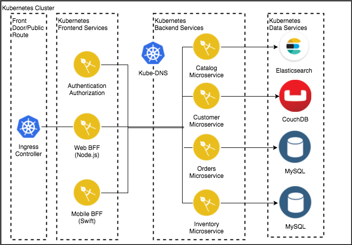

# Cloud Native Java Microservices - Reference implementation based on Kubernetes

## Table of Contents

* [Introduction](#introduction)
* [Architecture](#architecture)
* [Application Overview](#application-overview)
* [Implementation](#implementation)
* [References](#references)

## Introduction

This project provides a reference implementation for running a Cloud Native Application which leverages the [**Java MicroProfile**](https://microprofile.io/) and [**Spring Boot**](https://projects.spring.io/spring-boot/) technologies for its microservices. The target cloud environment for the application is a [**Kubernetes-based**](https://kubernetes.io/) platform which might be [**Minikube**](https://kubernetes.io/docs/getting-started-guides/minikube/) / [**Docker Edge**](https://docs.docker.com/edge/) for development stages and [**IBM Cloud**](https://www.ibm.com/cloud/) or [**IBM Cloud Private**](https://www.ibm.com/cloud-computing/products/ibm-cloud-private/) for production stages.

## Architecture

    

## Application Overview

The application is a simple store front shopping application that displays a catalog of antique computing devices, where users can search and buy products.  It has a Web interface, and it relies on BFF (Backend for Frontend) services to interact with the backend data.

There are several components of this architecture.

- This OmniChannel application contains an [AngularJS](https://angularjs.org/) based web application. The diagram depicts it as a Browser.
- The Web app invoke its own backend Microservices to fetch data, we call these components BFFs, following the [Backend for Frontends](http://samnewman.io/patterns/architectural/bff/) pattern. The Web BFF is implemented using the Node.js Express Framework. These Microservices are packaged as Docker containers and managed by the Kubernetes cluster.
- These BFFs invoke another layer of reusable Java Microservices.  They run inside a Kubernetes cluster, for example the [IBM Cloud Container Service](https://www.ibm.com/cloud-computing/bluemix/containers) or [IBM Cloud Private](https://www.ibm.com/cloud-computing/products/ibm-cloud-private/), using [Docker](https://www.docker.com/).
- The Java Microservices retrieve their data from the following databases:
  - The Catalog service retrieves items from a searchable JSON datasource using [ElasticSearch](https://www.elastic.co/).
  - The Customer service stores and retrieves Customer data from a searchable JSON datasource using [IBM Cloudant](https://www.ibm.com/cloud/cloudant)
  - The Inventory and Orders Services use separate instances of [MySQL](https://www.mysql.com/).

## Implementation

This application has been implemented using two of the most popular technologies used for Java microservices development.
- [**Java MicroProfile Implementation**](https://github.com/ibm-cloud-architecture/refarch-cloudnative-kubernetes/tree/microprofile#cloud-native-development-with-microprofile-websphere-liberty-and-ibm-cloud-private)
- [**Spring Boot Implementation**](https://github.com/ibm-cloud-architecture/refarch-cloudnative-kubernetes/tree/spring#run-a-cloud-native-microservices-application-on-a-kubernetes-cluster) 

  
  
  &nbsp;&nbsp;&nbsp;&nbsp;&nbsp;&nbsp;&nbsp;&nbsp;&nbsp;&nbsp;&nbsp;&nbsp; 

## References

- [Java MicroProfile](https://microprofile.io/)
- [Spring Boot](https://projects.spring.io/spring-boot/)
- [Kubernetes](https://kubernetes.io/)
- [Minikube](https://kubernetes.io/docs/getting-started-guides/minikube/)
- [Docker Edge](https://docs.docker.com/edge/)
- [IBM Cloud](https://www.ibm.com/cloud/)
- [IBM Cloud Private](https://www.ibm.com/cloud-computing/products/ibm-cloud-private/)
