# Exploring Istio Service Mesh Features with the Microservices Reference Architecture Application
**Author:** Fabio Gomez (fabiogomez@us.ibm.com)

## Table of Contents
  * [Introduction](#introduction)
  * [Requirements](#requirements)
  * [Blue-Compute Istiofied](#blue-compute-istiofied)
    + [Architecture](#architecture)
    + [Requirements for Pods and Services](#requirements-for-pods-and-services)
    + [Liveness and Readiness Probes](#liveness-and-readiness-probes)
    + [StatefulSet-Based Services](#statefulset-based-services)
    + [Custom Istio YAML Files](#custom-istio-yaml-files)
      - [Authentication Policy](#authentication-policy)
      - [Destination Rule](#destination-rule)
      - [Virtual Service](#virtual-service)
      - [Gateway](#gateway)
      - [Istio YAML files in the main bluecompute-ce chart](#istio-yaml-files-in-the-main-bluecompute-ce-chart)
      - [Recap](#recap)
  * [Deploying Istio Helm Chart](#deploying-istio-helm-chart)
  * [Deploy Istiofied Bluecompute Helm Chart](#deploy-istiofied-bluecompute-helm-chart)
    + [Setup Helm Repository](#setup-helm-repository)
    + [Deploy the Chart](#deploy-the-chart)
    + [Manually Run the User Creation Job](#manually-run-the-user-creation-job)
    + [Validate the Application](#validate-the-application)
  * [Telemetry & Tracing](#telemetry--tracing)
    + [Generating Load](#generating-load)
    + [Access Grafana Dashboard](#access-grafana-dashboard)
    + [Access Service Graph Dashboard](#access-service-graph-dashboard)
    + [Access Jaeger Tracing Dashboard](#access-jaeger-tracing-dashboard)
    + [Access Kiali Dashboard](#access-kiali-dashboard)
  * [Cleanup](#cleanup)
  * [Conclusion](#conclusion)

## Introduction
The journey to cloud-native microservices comes with great technical benefits. As we saw in the microservices reference architecture (Bluecompute) we were able to individually deploy, update, test, and manage individual microservices that comprise the overall application. By leveraging `Helm`, we are able to individually package these services into charts and package those into an umbrella chart that deploys the entire application stack in under 1 minute.

Having such flexibility comes at a price though. For example, the more microservices you have, the more complicated it becomes to manage, deploy, update, monitor, and debug them. Also, having more microservices makes it more difficult to start introducing things like canary releases, routing policies, and Mutual TLS encryption since implementing those things will vary depending on the nature of each microservice (i.e. Java vs Node.js services), which means your team has to spend more time learning how to implement those things on each technology stack.

Luckily, the Kubernetes community is aware of these limitations and has provided us with the concept of a `Service Mesh`. As explained [here](https://istio.io/docs/concepts/what-is-istio/#what-is-a-service-mesh), the term service mesh is used to describe the network of microservices that make up such applications and the interactions between them. The best known service mesh project is [`Istio`](https://istio.io/), which was co-developed by IBM and Google. Istio's aim is to help you connect, secure, control, and observe your services in a standardized and language-agnostic matter that doesn't require any code changes to the services.

In this document, we will deploy Istio into a Kubernetes envinronment (IBM Cloud Kubernetes Service or IBM Cloud Private) and explore some of its out the box features (Routing, Mutual TLS, Ingress Gateway, and Telemetry) after deploying the Bluecompute chart into the Istio-enabled environment.

## Requirements
* Kubernetes Cluster
	+ [IBM Cloud Kubernetes Service](https://www.ibm.com/cloud/container-service) - Create a Kubernetes cluster in IBM Cloud.  The application runs in the Lite cluster, which is free of charge.  Follow the instructions [here](https://console.bluemix.net/docs/containers/container_index.html).
	+ [IBM Cloud Private](https://www.ibm.com/cloud/private) - Create a Kubernetes cluster in an on-premise datacenter.  The community edition (IBM Cloud Private CE) is free of charge.  Follow the instructions [here](https://www.ibm.com/support/knowledgecenter/en/SSBS6K_3.1.0/installing/installing.html) to install IBM Cloud Private CE.
* [kubectl](https://kubernetes.io/docs/user-guide/kubectl-overview/) (Kubernetes CLI) - Follow the instructions [here](https://kubernetes.io/docs/tasks/tools/install-kubectl/) to install it on your platform.
* [helm](https://github.com/kubernetes/helm) (Kubernetes package manager) - Follow the instructions [here](https://github.com/kubernetes/helm/blob/master/docs/install.md) to install it on your platform.
	+ If using `IBM Cloud Private`, we recommend you follow these [instructions](https://www.ibm.com/support/knowledgecenter/SSBS6K_3.1.0/app_center/create_helm_cli.html) to install `helm`.
	+ If using IBM Cloud Kubernetes Service (IKS), please use the most up-to-date version of helm

## Blue-Compute Istiofied
As with any complex application architecture, we had to make some changes to fully support the `bluecompute-ce` application in the Istio service mesh. Luckily, those changes were minimal but were necessary to leverage most of Istio's features and follow best practices.

### Architecture
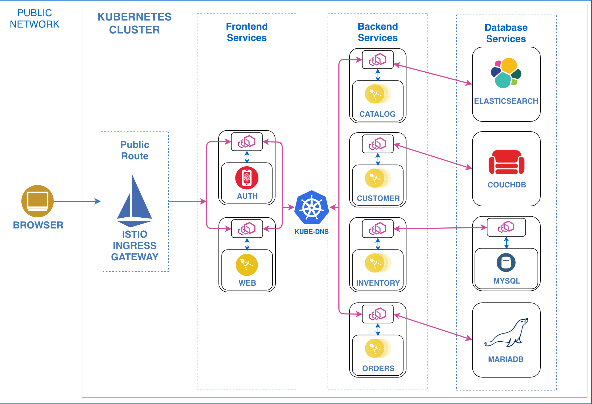

You will notice that, compared to the original [architecture diagram](../../static/imgs/app_architecture.png), the overall application remains the same, minus a few additions:
* Instead of an Ingress Controller or NodePort, the application is now made publicly available via the Istio Ingress Gateway.
* All service pods now have an [Envoy Proxy](https://istio.io/docs/concepts/what-is-istio/#envoy) sidecar container, which intercepts and routes traffic from the application container to and from the other services.
  + The exception are the [StatefulSet-Based Services](#statefulset-based-services) (Elasticsearch, CouchDB, and MariaDB), which don't work well with Istio at the moment.
  + All details explained in the [StatefulSet-Based Services](#statefulset-based-services) section.
  + The Envoy proxy can also be used to establish Mutual TLS connections between the services if desired, which we will explain in later sections.
  + The Envoy proxy is also used to collect rich metrics, which will explore in later sections.

As you can see, the majority of the application was successfully modified to work with and leverage Istio's features. For the services that couldn't be made to work with Istio, we were still able to expose them to the service mesh and establish connections with those services in the service mesh. More details on that in later session.

Now let's go over what it took to get services to work with Istio in mode detail.

### Requirements for Pods and Services
Istio needs basic information from each service in order to do things such routing traffic between multiple service versions and also add contextual information for its distributed tracing and telemetry features.

The first requirement, which luckily we had already implemented, was to name the service ports using the protocol name. For the bluecompute service, the service ports were named `http`.

The second requirement was to have explicit `app` and `version` labels for each service deployment. Having these labels provides Istio with the enough context for its routing, tracing, and telemetry features, which will explore in later sections.

Here is the YAML for the `inventory` service, which as you can see, includes the named `http` port and both the `app` and `version` labels:

```yaml
apiVersion: v1
kind: Service
metadata:
  labels:
    app: inventory
    chart: inventory-0.6.0
    heritage: Tiller
    release: bluecompute
    tier: backend
    version: v1
  name: inventory
  namespace: default
spec:
  ports:
  - name: http
    port: 8080
    protocol: TCP
    targetPort: 8080
  selector:
    app: inventory
    chart: inventory-0.6.0
    heritage: Tiller
    release: bluecompute
    tier: backend
    version: v1
  type: ClusterIP
```

And here is a trimmed down version of the `inventory` deployment, which shows the `app` and `version` labels:
```yaml
apiVersion: extensions/v1beta1
kind: Deployment
metadata:
  labels:
    app: inventory
    chart: inventory-0.6.0
    heritage: Tiller
    release: bluecompute
    tier: backend
    version: v1
  name: inventory
  namespace: default
spec:
  selector:
    matchLabels:
      app: inventory
      chart: inventory-0.6.0
      heritage: Tiller
      release: bluecompute
      tier: backend
      version: v1
  template:
    metadata:
      labels:
        app: inventory
        chart: inventory-0.6.0
        heritage: Tiller
        release: bluecompute
        tier: backend
        version: v1
    spec:
      containers:
...
```

To learn more about all the requirements for pods and services, please look at Istio's official documentation below:
https://istio.io/docs/setup/kubernetes/spec-requirements/

### Liveness and Readiness Probes
Liveness and Readiness probes are used in Kubernetes to run continuous health checks to determine if a deployment is healthy or not. When you bring Istio into the picture, the probes may stop working if you enable Mutual TLS encryption between services, which makes Kubernetes erroneously think that the services are unhealthy. The reason they stop working is because the liveness and readiness probes are run by the kubelets, which are not part of the service mesh and, therefore, do not benefit from Istio's Mutual TLS.

The `bluecompute-ce` service originally did not have any liveness and readiness probes, so none of the services were affected. But since we are committed to explore most of Istio's features through `bluecompute-ce`, we decided to add our own Liveness and Readiness probes to each service.

Since we knew in advance that we wanted to use Mutual TLS between our services, we knew we had to find a way to implement liveness and readiness probes that would work in environments with Mutual TLS enabled or disabled.

The best approach we found was to open a separate non-Istiofied port that would only serve the `/health` endpoint. We accomplished this by enabling the [Spring Boot Actuator](https://docs.spring.io/spring-boot/docs/current/reference/html/production-ready-endpoints.html) endpoints on a separate port. By implementing this approach, we separated the service's application endpoints (which will be protected by Istio's Mutual TLS) from the its health endpoints (which we can afford to leave in in plain HTTP).

To implement the actuator feature, we first had to add the actuator dependency on the services' `build.gradle` files. Here is a snippet of that would look like:
```gradle
dependencies {
	...
	compile("org.springframework.boot:spring-boot-starter-actuator")
	...
}
```

To enable the actuator feature itself on a separate port, we have to specify the new port in the `application.yml` file. Here is a snippet of the `application.yml` file from the Inventory service, where we enabled the actuator endpoints on a separate port:
```yaml
...
# Server configuration
server:
  context-path: /micro
  port: ${SERVICE_PORT:8080}

management:
  port: ${MANAGEMENT_PORT:8090}
...
```

Now if you run the application locally, you can curl the `/health` endpoint on its management port and you will get its current health status in JSON format. To expose this port in a container, you have to add the new port to its list of exposed ports in its Dockerfile. For the Inventory service, the `EXPOSE` line in its Dockerfile will list the 2 ports as follows:
```Dockerfile
EXPOSE 8080 8090
```

Finally, now the we went over the above, here is a snippet of what the Inventory Deployment YAML will look like with the Liveness and Readiness Probes enabled:
```yaml
apiVersion: extensions/v1beta1
kind: Deployment
...
spec:
...
  template:
...
    spec:
      containers:
        name: inventory
...
        livenessProbe:
          failureThreshold: 6
          httpGet:
            path: /health
            port: 8090
            scheme: HTTP
          initialDelaySeconds: 35
          periodSeconds: 20
          successThreshold: 1
          timeoutSeconds: 1
        readinessProbe:
          failureThreshold: 6
          httpGet:
            path: /health
            port: 8090
            scheme: HTTP
          initialDelaySeconds: 20
          periodSeconds: 10
          successThreshold: 1
          timeoutSeconds: 1
        ports:
        - containerPort: 8080
          protocol: TCP
...
```

With the above implemented, we are able to constantly monitor our services with Liveness and Readiness probes while leveraging Istio's Mutual TLS, if enabled!

To learn more about Liveness and Readiness Probes with Istio, check out the document below:
* https://istio.io/docs/tasks/traffic-management/app-health-check/

To accomplish the above in the `bluecompute-web` service, which is a Node.JS app, we had to instantiate a separate Express server that listens on a different port and only serves a custom `/health` endpoint, similar to the Spring Boot services. To learn more about how that was accomplished, check out the git commit below:
* https://github.com/ibm-cloud-architecture/refarch-cloudnative-bluecompute-web/commit/7de6a4431e478435b3f34144652d8005483d3bdb

### StatefulSet-Based Services
In the `bluecompute-ce` chart we use a combination of Deployment and StatefulSet services to run the entire application. The StatefulSet service in the `bluecompute-ce` application include `Elasticsearch`, `MariaDB`, and `CouchDB`. These services benefit from StatefulSets because they provide a sticky identity for each of their pods, which is essential to keep the stateful nature of these services.

Unfortunately, Istio does not fully support StatefulSets yet, which prevents the Elasticsearch, MariaDB, and CouchDB services from starting. If you look at the following document, it says that if you disable Mutual TLS, the StatefulSet services should just work, but that's not the case for these workloads:
* https://istio.io/docs/setup/kubernetes/quick-start/#option-1-install-istio-without-mutual-tls-authentication-between-sidecars

**NOTE:** If you want to find out more about Istio and StatefulSets and whether it will be supported, here is an issue that is currently tracking support for StatefulSets in Istio:
* https://github.com/istio/istio/issues/10659

In the meantime, we had to figure out another way to make the StatefulSet services work in Istio, even when Mutual TLS is enabled for the non-StatefulSet workloads. After doing some reading, we ended up doing the following:
* Disabling automatic sidecar injection in Elasticsearch, MariaDB, and CouchDB.
	+ We accomplished this by passing the `sidecar.istio.io/inject: "false"` annotation to their respective StatefulSets. Here is how it was done for each of those services:
		- [bluecompute-ce/values-istio-basic.yaml#L166](../../bluecompute-ce/values-istio-basic.yaml#L166)
		- [bluecompute-ce/values-istio-basic.yaml#L175](../../bluecompute-ce/values-istio-basic.yaml#L175)
		- [bluecompute-ce/values-istio-basic.yaml#L184](../../bluecompute-ce/values-istio-basic.yaml#L184)
		- [bluecompute-ce/values-istio-basic.yaml#L265](../../bluecompute-ce/values-istio-basic.yaml#L265)
		- [bluecompute-ce/values-istio-basic.yaml#L413](../../bluecompute-ce/values-istio-basic.yaml#L413)
		- [bluecompute-ce/values-istio-basic.yaml#L424](../../bluecompute-ce/values-istio-basic.yaml#L424)
	+ This effectively takes out the services from the service mesh, which allowed them to start normally.
	+ However, by leaving the services out from the service mesh, we are preventing the services in the service mesh from communicating with these services when Mutual TLS is enabled, which we overcame with the following.
	+ **NOTE:** Luckily, the Elasticsearch and MariaDB helm charts had the ability to let you provide custom annotations. However, for the CouchDB, we had to fork and edit the chart to enable the ability to provide custom annotations, as shown in the commit below:
		- https://github.com/fabiogomezdiaz/charts/commit/eb51b4f7f66837830385292b7d6220f8048a9537
* Created `DestinationRules` that explicitly indicate that Mutual TLS is not needed to communicate with Elasticsearch, MariaDB, and CouchDB.

Here is a snippet of the Elasticsearch `DestinationRule`, where we disble the need for Mutual TLS:
```yaml
apiVersion: networking.istio.io/v1alpha3
kind: DestinationRule
metadata:
  name: {{ template "bluecompute.elasticsearch.client.fullname" . }}
spec:
  host: {{ template "bluecompute.elasticsearch.client.fullname" . }}.{{ .Release.Namespace }}.svc.cluster.local
  trafficPolicy:
    portLevelSettings:
    - port:
        number: 9200
      tls:
        mode: DISABLE
    - port:
        number: 9300
      tls:
        mode: DISABLE
```

By doing the above for Elasticsearch, MariaDB, and CouchDB, the services were able to start and we were able to have the Istio-enabled services communicate with them. If you are curious what all the Destination Rules look like for these services, take a look at them here:
* [bluecompute-ce/templates/istio_destination_rules.yaml](../../bluecompute-ce/templates/istio_destination_rules.yaml)

**NOTE:** The following article was useful for determining when to disable sidecar injection.
* https://istio.io/help/ops/setup/injection/

### Custom Istio YAML Files
By doing the stuff we talked about above, the entire `bluecompute-ce` application is now able to leverage most of Istio's features automatically, such as automatic sidecar injection, Mutual TLS, Telemetry and Tracing.

It is great to have Istio automatically inject sidecars, configure Authentication Policies (Mutual TLS), Destination Rules, and Virtual Services for you. However, sometimes your individual services might require more granular control. Perhaps not all application services can benefit from or require Mutual TLS. Perhaps, like in the case with Elasticsearch, MariaDB, and CouchDB, not all of your existing application services meet the requirements for service mesh support and must be handled on a 1x1 basis. In such cases, having Istio automatically handle everything for you is not ideal and you have to manually configure Istio settings for your services.

In this section, we are going to cover 3 basic Istio YAML files that are present on each microservice's Helm chart:
* Authentication Policy.
* Destination Rule.
* Virtual Service.
* Gateway.

#### Authentication Policy
Istio allows you to configure Transport Authentication (Mutual TLS), also known as service-to-service authentication, on multiple levels: cluster, namespace, and service. To create a Service-specific Policy, let's look at the Inventory service policy:
```yaml
apiVersion: "authentication.istio.io/v1alpha1"
kind: "Policy"
metadata:
  name: {{ template "inventory.fullname" . }}
spec:
  targets:
  - name: {{ template "inventory.fullname" . }}
    ports:
    - number: {{ .Values.service.externalPort }}
  peers:
  {{- if eq .Values.istio.mTLS "ISTIO_MUTUAL" }}
  - mtls: {}
  {{- end }}
```
Where:
* `spec.targets[0].ports[0].number` is the service port where this policy will be applied.
	+ **NOTE:** This port is the service's application port, and NOT the management/health port used in liveness and readiness probes.
* `spec.peers[0].mtls` is section that, if provided, enables Mutual TLS for the port above.
	+ At the time of writing, there are no additional settings to configure for Mutual TLS, hence the value of `{}` in the `mtls` field.

By using the above service-specific policy, Istio will isolate this service from any namespace or cluster specific policies.

To learn more about Authentication Policies, read the following document:
* https://istio.io/docs/concepts/security/#authentication-policies

#### Destination Rule
A `DestinationRule` configures the set of policies to be applied to a request after VirtualService (explained in the following section) routing has occurred. They describe the circuit breakers, load balancer settings, TLS settings, and other settings for a specific service. A single `DestinationRule` can also include settings for multiple subsets/versions of the same service. Let's take a look at the Inventory service Destination Rule:
```yaml
apiVersion: networking.istio.io/v1alpha3
kind: DestinationRule
metadata:
  name: {{ template "inventory.fullname" . }}
spec:
  host: {{ template "inventory.fullname" . }}.{{ .Release.Namespace }}.svc.cluster.local
  trafficPolicy:
    loadBalancer:
      simple: {{ .Values.istio.loadBalancer }}
    portLevelSettings:
    - port:
        number: {{ .Values.service.externalPort }}
      tls:
        mode: {{ .Values.istio.mTLS }}
  subsets:
  - name: v1
    labels:
      version: v1
```

Where:
* `spec.host` is the Fully Qualified Domain Name of the service in question.
* `spec.trafficPolicy.loadBalancer.simple` is where you define the type of load balancing to apply on the service.
* `spec.trafficPolicy.portLevelSettings` is where you specify the TLS mode for this service and the port number to apply it to.
	+ **NOTE:** This port is the service's application port, and NOT the management/health port used in liveness and readiness probes.
* `spec.subsets` is where list the available subsets/versions of the service and their individual settings, if any.
	+ If not version-specific settings are passed here, each version will inherit the settings listed above.


To learn more about Destination Rules, read the following document:
* https://istio.io/docs/concepts/traffic-management/#destination-rules

#### Virtual Service
The last thing. A `VirtualService` defines the rules that control how requests for a service are routed within an Istio service mesh. For example, a virtual service could route requests to different versions of a service or to a completely different service than was requested. Requests can be routed based on the request source and destination, HTTP paths and header fields, and weights associated with individual service versions. Let's take a look at the Inventory service Virtual Service:

```yaml
apiVersion: networking.istio.io/v1alpha3
kind: VirtualService
metadata:
  name: {{ template "inventory.fullname" . }}
spec:
  hosts:
  {{- if or .Values.istio.gateway.enabled .Values.istio.gateway.name .Values.global.istio.gateway.name }}
  {{ toYaml .Values.istio.gateway.hosts }}
  {{- else }}
  - {{ template "inventory.fullname" . }}.{{ .Release.Namespace }}.svc.cluster.local
  {{- end }}
  {{- template "inventory.istio.gateway" . }}
  http:
  - match:
    - uri:
        prefix: {{ .Values.ingress.path }}
    route:
    - destination:
        host: {{ template "inventory.fullname" . }}.{{ .Release.Namespace }}.svc.cluster.local
        port:
          number: {{ .Values.service.externalPort }}
        subset: v1
```

Where:
* `spec.hosts` is where you specify the Fully Qualified Domain Names (FQDN) of the service in question.
	+ As you can see, in this field there is some logic that determines which FQDN to use, which can be a single hostname of multiple.
	+ When an Istio Gateway (explained in the following section) is used to expose the service outside of the cluster, you need to provide the FQDN(s) that is used to access that service in this list so that the Virtual Service can route the external request to the correct service.
	+ If not using a Gateway, then you need provide the internal FQDN for the service, which is in the form of `service.namespace.svc.cluster.local`.
* `spec.gateways` is where you provide the gateway names, if any, to bind the Virtual Service to in order to route external cluster traffic to the service.
	+ **NOTE:** You can't see `spec.gateways` field in the YAML above directly because we are using a Helm template to handle the gateway logic. Having an empty list of gateway names will cause an error.
* `spec.http[0].match[0].uri.prefix` is where you specify the request path(s) that will be routed to the service.
* `spec.http[0].route[0].destination.host` is the FQDN of the service to route the request path to.
	+ This is useful if you want to route different paths to different subsets/versions of your service.
* `spec.http[0].route[0].destination.port.number` is the application port number for the service subset/version.
* `spec.http[0].route[0].destination.subset` is the subset/version to route the request to.

Even though we are only using one subset/version for our service, from the YAML above you can already see how easy it is to apply routing rules for multiple service versions from one place.

To learn more about Virtual Services, read the following document:
* https://istio.io/docs/concepts/traffic-management/#virtual-services

#### Gateway
The last custom Istio YAML file we are going to look at is an Istio Gateway. A `Gateway` configures a load balancer for HTTP/TCP traffic, most commonly operating at the edge of the mesh to enable ingress traffic for an application.

Unlike Kubernetes Ingress, Istio Gateway only configures the L4-L6 functions (for example, ports to expose, TLS configuration). Users can then use standard Istio rules to control HTTP requests as well as TCP traffic entering a Gateway by binding a VirtualService to it. Let's take a look at the Inventory service Gateway:

```yaml
apiVersion: networking.istio.io/v1alpha3
kind: Gateway
metadata:
  name: {{ template "inventory.fullname" . }}-gateway
spec:
  selector:
    istio: ingressgateway
  servers:
  - port:
      number: 80
      name: http
      protocol: HTTP
    tls:
      httpsRedirect: {{ .Values.istio.gateway.TLS.httpsRedirect }}
    hosts:
    {{ toYaml .Values.istio.gateway.hosts }}
{{- if .Values.istio.gateway.TLS.enabled }}
  - port:
      number: 443
      name: https
      protocol: HTTPS
    tls:
      mode: {{ .Values.istio.gateway.TLS.mode }}
      serverCertificate: {{ .Values.istio.gateway.TLS.serverCertificate }}
      privateKey: {{ .Values.istio.gateway.TLS.privateKey }}
{{- if and (eq .Values.istio.gateway.TLS.mode "MUTUAL") .Values.istio.gateway.TLS.caCertificates }}
      caCertificates: {{ .Values.istio.gateway.TLS.caCertificates }}
{{- end }}
    hosts:
    {{ toYaml .Values.istio.gateway.hosts }}
```

Where:
* `spec.servers[0].port` is where you can specify the port number (80 or 443), name, and protocol (HTTP or HTTPS) supported by the Gateway.
* `spec.servers[0].tls` is where you can provide TLS settings for the port, such as `httpsRedirect` (to redirect HTTP traffic to HTTPS), TLS mode (Simple TLS, Mutual TLS, or none), and TLS certificate files (via `serverCertificate`, `privateKey`, and `caCertificates`).
* `spec.servers[0].hosts` is where you provide the external FQDN(s) used to route traffic into the cluster.

Remember that in order to leverage the gateway, the gateway must be bound to a `Virtual Service` by putting the gateway name in the `spec.gateways` field of the Virtual Service, as shown in the previous section.

Assuming you enabled the gateway and bound it to the Virtual Service correctly, Istio will route external traffic to your service and collect Telemetry and Tracing information for it as well.

To learn more about Gateways, read the following document:
* https://istio.io/docs/concepts/traffic-management/#gateways

#### Istio YAML files in the main bluecompute-ce chart
All the Istio YAML files we talked about in the sections above are mostly specific to the individual microservice charts. The main `bluecompute-ce` leverages those YAML files along with additional Istio YAML files meant for the services Community Charts (MySQL, Elasticsearch, MariaDB, and CouchDB) that we cannot not edit directly. If you are curious to learn about those files, check them out here:
* [bluecompute-ce/templates/istio_auth_policies.yaml](../../bluecompute-ce/templates/istio_auth_policies.yaml)
* [bluecompute-ce/templates/istio_destination_rules.yaml](../../bluecompute-ce/templates/istio_destination_rules.yaml)
* [bluecompute-ce/templates/istio_virtual_services.yaml](../../bluecompute-ce/templates/istio_virtual_services.yaml)

The `bluecompute-ce` chart disables all of the individual gateways in favor of a global gateway, which you can checkout here:
* [bluecompute-ce/templates/istio_gateway.yaml](../../bluecompute-ce/templates/istio_gateway.yaml)

Lastly, in order to avoid tweaking multiple values files or typing long commands to install `bluecompute-ce` with Istio enabled, we decided to provide separate values files, which you can see here:
* [bluecompute-ce/values-istio-basic.yaml](../../bluecompute-ce/values-istio-basic.yaml)
	+ This file just enables Istio for all of the microservices using the settings and files we talked about before.
	+ The only thing is that to access the web application we have to use port-forward the web application to our local machine.
* [bluecompute-ce/values-istio-gateway.yaml](../../bluecompute-ce/values-istio-gateway.yaml)
	+ This file is similar to the file above but has the settings to enable the Global Istio Gateway.
	+ This chart assumes that you have created wildcard SSL certificate for the `bluecompute.com` domain name and uploaded they certificate and keys as secrets into the Kubernetes cluster.
	+ More details on how to deploy the Gateway in the later section.
	+ You can check out the Gateway settings here:
		- [bluecompute-ce/values-istio-gateway.yaml#L11](../../bluecompute-ce/values-istio-gateway.yaml#L11)

#### Recap
You have seen the basic Istio YAML files that we included on each microservice's Helm chart. Having these files will allow each microservice to have more control of its Istio settings rather than leave it all up to Istio and potentially run into issues if certain services are not ready for Istio prime-time yet.

On top of the above Istio YAML files, each individual microservice has Istio YAML files to configure settings for their individual data stores, which are optional if you are using the main `bluecompute-ce` Helm chart but are useful if you are deploying each microservice and its datastore individually.

## Deploying Istio Helm Chart
To deploy Istio into either an IBM Cloud Kubernetes Service (IKS) or IBM Cloud Private (ICP) cluster, we will be using IBM's official [Istio Helm Chart](https://github.com/IBM/charts/tree/master/stable/ibm-istio). The benefit of using the chart is that it's easier to toggle on/off different Istio components such as Ingress and Egress gateways. The chart also comes bundled with non-Istio components such as Grafana, Service Graph, and Kiali, which we can also toggle on/off. Today we are going to deploy the Istio chart with the following components enabled:
* Ingress Gateway
* Grafana
* Service Graph
* Jager (Tracing)
* Kiali

To deploy the chart we have to add the `IBM Cloud Charts` Helm repository as follows:
```bash
helm repo add ibm-charts https://registry.bluemix.net/helm/ibm-charts
```

If using a Helm version prior to 2.10.0, install Istio’s Custom Resource Definitions via kubectl apply, and wait a few seconds for the Custom Resource Definitions (CRDs) to be committed in the kube-apiserver:
```bash
kubectl apply -f https://raw.githubusercontent.com/IBM/charts/master/stable/ibm-istio/templates/crds.yaml
```

>It should be that noted above that if these CRDs were applied to a version greater than 2.10.0, an error similar to `Error: customresourcedefinitions.apiextensions.k8s.io "gateways.networking.istio.io" already exists` will appear. To resolve the conflict, delete the conflicting CRDs, in this case
>```
>kubectl delete crd gateways.networking.istio.io
>```
>
>If confident, you can delete all CRDs with a
>```
>kubectl delete crd --all
>```

Since we are enabling `kiali`, we also need to create the secret that contains the username and passphrase for kiali dashboard as follows:

```bash
# Username and Passphrase in base64 format
DASHBOARD_USERNAME=$(echo -n 'admin' | base64);
DASHBOARD_PASSPHRASE=$(echo -n 'secret' | base64);

# Namespace
NAMESPACE="istio-system";

cat <<EOF | kubectl apply -f -
apiVersion: v1
kind: Secret
metadata:
  name: kiali
  namespace: $NAMESPACE
  labels:
    app: kiali
type: Opaque
data:
  username: $DASHBOARD_USERNAME
  passphrase: $DASHBOARD_PASSPHRASE
EOF
```

Now we can deploy the Istio chart in the `istio-system` namespaces as follows:
```bash
# Install Istio Chart and enable Grafana, Service Graph, and Jaeger (tracing)

# IBM Cloud Kubernetes Service
helm upgrade --install istio --version 1.0.4 \
	--set grafana.enabled=true \
	--set servicegraph.enabled=true \
	--set tracing.enabled=true \
	--set kiali.enabled=true \
	ibm-charts/ibm-istio --namespace istio-system

# On IBM Cloud Private Ingress should be of NodePort type
helm upgrade --install istio --version 1.0.4 \
	--set ingress.service.type=NodePort \
	--set grafana.enabled=true \
	--set servicegraph.enabled=true \
	--set tracing.enabled=true \
	--set kiali.enabled=true \
	ibm-charts/ibm-istio --namespace istio-system --tls
```

**NOTE:** At the time of writing, Istio 1.0.4 is the latest Istio version that the Helm chart supports.

Before moving forward, Make sure all Istio-related pods are running as follows:
```bash
kubectl get pods -n istio-system -w
```

Istio works best when you leverage its automatic sidecar injection feature, which automatically puts all of the YAML pertaining to the Istio side car into your deployments/pods upon deployment. In order to leverage Istio's automatic sidecar injection feature, we need to enable it by labeling the namespace that will leverage this feature. In our case we will use the `default` namespace, which you can label as follows:
```bash
kubectl label namespace default istio-injection=enabled
```

You have successfully deployed the Istio chart and enabled automatic sidecar injection on the `default` namespace! Before installing the `bluecompute-ce` helm chart, let's first take a look at the changes & considerations we had to make to make the `bluecompute-ce` chart Istio compatible.

## Deploy Istiofied Bluecompute Helm Chart
Now that we covered all of the basics concepts and the changes that went into making `bluecompute-ce` Istio-enabled, let's go ahead and deploy it into our Istio-enabled cluster.

### Setup Helm Repository
If you are using IBM Cloud Private 3.1 and later, create an image policy that will allow Docker images from Docker Hub as follows:
```bash
kubectl apply -f https://raw.githubusercontent.com/ibm-cloud-architecture/refarch-cloudnative-kubernetes/spring/static/image_policy.yaml
```

Now let's proceed with installing the `bluecompute-ce` chart itself as follows:
```bash
# Add Helm repository
helm repo add ibmcase https://raw.githubusercontent.com/ibm-cloud-architecture/refarch-cloudnative-kubernetes/spring/docs/charts/bluecompute-ce

# Refresh Helm repositories
helm repo update
```

### Deploy the Chart
As mentioned earlier, to make things easier we made a separate [bluecompute-ce/values-istio-gateway.yaml](../../bluecompute-ce/values-istio-gateway.yaml) file that is pre-configured with most of the Istio settings needed to enable the chart with Istio and also create a simple Istio Ingress Gateway. If you look in [line 9](../../bluecompute-ce/values-istio-gateway.yaml#L9) you will see all of the global Istio settings, which the dependency charts will pick up to enable the Istio YAML files.

Since we are not using a custom domain name for the Istio Ingress Gateway, we need to setup it up to accept requests from any domain (works for demo purposes but NOT RECOMMENDED FOR PRODUCTION USE), which we did in [line 15](../../bluecompute-ce/values-istio-gateway.yaml#L15) for the Gateway by passing `*` to the hosts list. For the Web Virtual Service to accept requests from any domain through the Istio Ingress Gateway, we need to pass the `*` to the hosts list, which we did in [line 478](../../bluecompute-ce/values-istio-gateway.yaml#L478). Feel free to explore the [Global Gateway](../../bluecompute-ce/templates/istio_gateway.yaml) and the [Web Virtual Service](https://github.com/ibm-cloud-architecture/refarch-cloudnative-bluecompute-web/blob/spring/chart/web/templates/istio_virtual_service.yaml) YAML files to learn how we set them up.

Now, using the edited values file, install the chart with the command below:
```bash
# Install helm chart
helm upgrade --install bluecompute --namespace default \
	-f https://raw.githubusercontent.com/ibm-cloud-architecture/refarch-cloudnative-kubernetes/spring/bluecompute-ce/values-istio-gateway.yaml \
	ibmcase/bluecompute-ce # --tls if using IBM Cloud Private
```

It should take a few minutes for all of the pods to be up and running. Run the following command multiple times until all of the pods show a status of `RUNNING`.
```bash
kubectl get pods
```

### Manually Run the User Creation Job
We run certain jobs to pre-populate some of the databases with information, such as adding a user to the `CouchDB` database through the `customers` microservice. Because we have TLS enabled, the job won't be able to run the init containers that check on the status of the `customer` microservice due to racing conditions with the Istio sidecars.

Instead of trying to change the way we preload the database to take Istio into account, we just disable the job when Istio is enabled and run the following script, which does the following:
* Creates a JWT token to authenticate against the customer service and be able to run operations on it.
* Use `kubectl` to port-forward the customer service's ports to your local workstation.
	+ This bypasses the Istio layers and allows for an unencrypted single connection.
* Performs a CURL command, with the JWT token created above, that adds a user into the CouchDB customers database.
* Searches for the newly created user to confirm that it was created successfully.
* Kills the port-forwarding connection.

The logic above is the same logic as the Kubernetes job we disabled, minus the port forwarding part. Since we are only doing this once, it's acceptable to bypass Istio's layers.

To run the script that creates a user, run the commands below:
```bash
# Get the script
wget https://raw.githubusercontent.com/ibm-cloud-architecture/refarch-cloudnative-kubernetes/spring/scripts/create_user.sh

# Make the script executable
chmod +x create_user.sh

# Run the script
./create_user.sh
```

If the script ran successfully, you should see an output similar to the following:

```bash
./create_user.sh
No NAMESPACE provided! Using default
Forwarding customer port 8082
Sleeping for 3 seconds while connection is established...
Starting Tests
Handling connection for 8082
create_user: ✅
Handling connection for 8082
search_user: ✅
```

You have successfully created a user in the customer database, which is the last part that was needed to get the Bluecompute application fully deployed.

### Validate the Application
In order to validate the application, you will need to access the IP address and port number of the Ingress Gateway, which will depend on the environment you are using. To access the IP address and port number, run the commands below based on your environment:
```bash
# IKS Standard Clusters
export INGRESS_HOST=$(kubectl -n istio-system get service istio-ingressgateway -o jsonpath='{.status.loadBalancer.ingress[0].ip}')
export INGRESS_PORT=$(kubectl -n istio-system get service istio-ingressgateway -o jsonpath='{.spec.ports[?(@.name=="http2")].port}')

# IKS Free Clusters
export INGRESS_HOST=$(kubectl get nodes -o jsonpath='{.items[0].status.addresses[?(@.type=="ExternalIP")].address}')
export INGRESS_PORT=$(kubectl get svc istio-ingressgateway -n istio-system -o jsonpath='{.spec.ports[0].nodePort}')

# IBM Cloud Private Cluster
export INGRESS_HOST=$(kubectl get po -l istio=ingressgateway -n istio-system -o 'jsonpath={.items[0].status.hostIP}')
export INGRESS_PORT=$(kubectl get svc istio-ingressgateway -n istio-system -o 'jsonpath={.spec.ports[0].nodePort}')

# Print the Gateway URL
export GATEWAY_URL=$INGRESS_HOST:$INGRESS_PORT
echo $GATEWAY_URL
```

To validate the application, open a browser window and enter the gateway URL from above and press enter. You should be able to see the web application's home page, as shown below.


You can reference [this link](https://github.com/ibm-cloud-architecture/refarch-cloudnative-bluecompute-web/tree/spring#validate-the-web-application) to validate the web application functionality. You should be able to see a catalog, be able to login, make orders, and see your orders listed in your profile (once you are logged in).

## Telemetry & Tracing
Now that we have deployed the `bluecompute-ce` chart into an Istio-enabled cluster and validated its functionality, let's explore Istio's telemetry and tracing features by generating some load and opening the different telemetry and tracing dashboards.

### Generating Load
Let's generate some load by performing multiple curl requests against the web service's `/catalog` endpoint through the Istio Gateway. By doing this, we generate telemetry and tracing metrics across the gateway and the web, catalog, and elasticsearch services. To generate the workload, open a new command prompt tab and enter the following command:

```bash
# Load Generation
echo "Generating load..."

while true; do
	curl -s ${GATEWAY_URL}/catalog > /dev/null;
	echo -n .;
	sleep 0.2;
done
```

Where `${GATEWAY_URL}` is the Ingress URL we obtained earlier. This script is going to run every 0.2 seconds indefinitely, unless we press `CTRL+C` to cancel it.

### Access Grafana Dashboard
To access the Grafana dashboard, you will need to run the following port-forwarding command:
```bash
kubectl -n istio-system port-forward $(kubectl -n istio-system get pod -l app=grafana -o jsonpath='{.items[0].metadata.name}') 3000:3000 &;
```

Now, open a new browser tab and go to http://localhost:3000 to open Grafana's home page, as shown below:
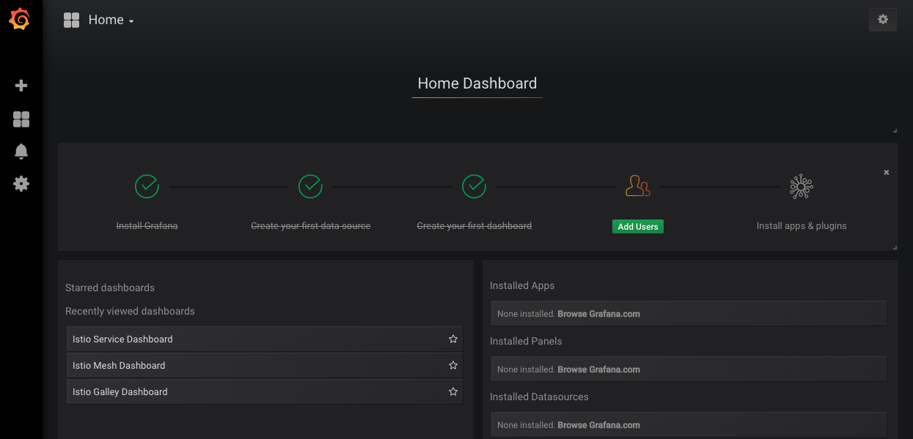

Click on the drop-down next to `Home` and click on the `Istio Service Dashboard` (as shown below) to examine networking requests for the individual services.


On the service drop-down at the top left, select `web.default.svc.cluster.local` service. You should be presented with a dashboard similar to the following:
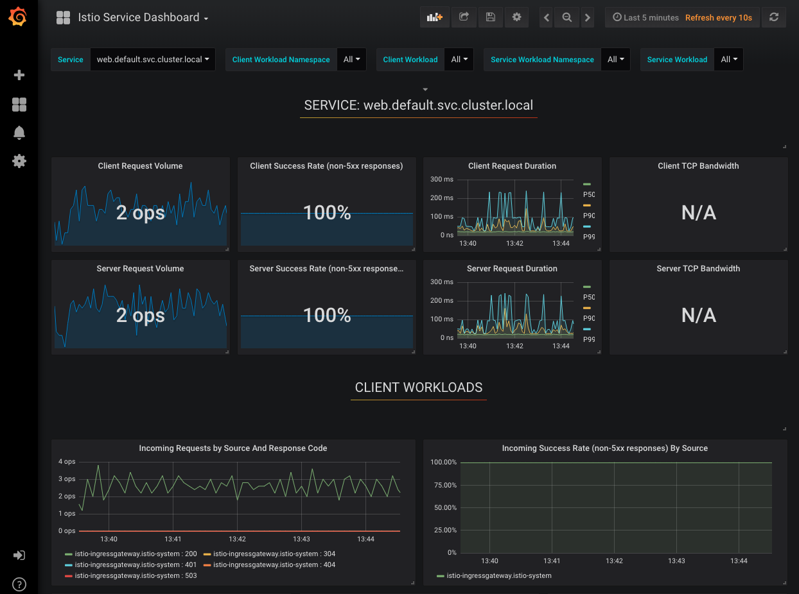

I'll leave it up to you to examine all the dashboards. The main thing I want to point out is the `Incoming Requests by Source And Response Code` dashboard at the bottom left. The load you see is generated from our script. If you were to interrupt the script, you will see, upon refreshing, that the load will go down to 0. Also notice that the source for all of these requests come directly from the `istio-ingressgateway.istio-system` since we are running our load generation script against the gateway itself instead of through a port-forwarding connection.

Now let's examine the `catalog` service by clicking on the Service drop-down and selecting `catalog.default.svc.cluster.local`, which will show you a dashboard similar to the one below:
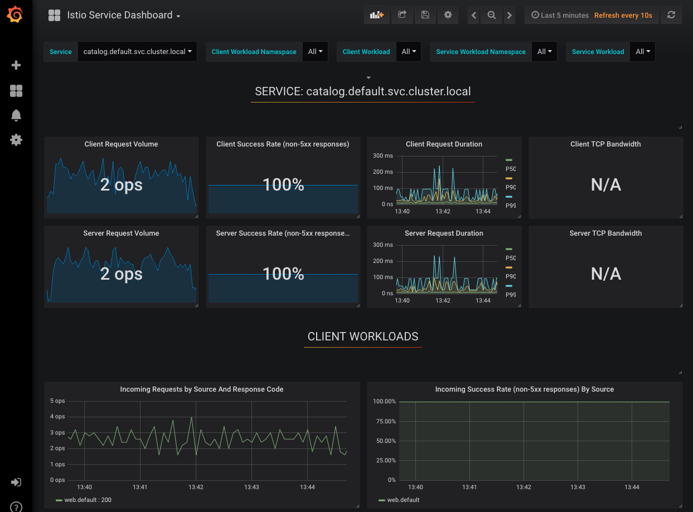

This is essentially the same dashboard. The traffic load should look about the same as with the `web` service. Notice in the `Incoming Requests by Source And Response Code` dashboard that all of the requests to the `catalog` service are coming from the `web.default` service, as expected.

You should now have a general idea of how to use Grafana with Istio to see the networking load in your cluster. I encourage you to explore the other Grafana dashboards that come with Istio.

### Access Service Graph Dashboard
Now let's explore `Service Graph` dashboard. Even though Grafana is helpful to debug networking for individual service, sometimes its more useful to see the bigger picture and take a look at a graph of all of your services and see how they are connected together. This is specially useful for new team members to understand your application's architecture, especially if it has grown incredibly complex.

To access the Service Graph dashboard, you will need to run the following port-forwarding command:
```bash
kubectl -n istio-system port-forward $(kubectl -n istio-system get pod -l app=servicegraph -o jsonpath='{.items[0].metadata.name}') 8088:8088 &;
```

Now, open a new browser tab and go to http://localhost:8088/force/forcegraph.html to open Service Graph dashboard, as shown below:


You might notice that the graph is constantly moving, that's because its constantly checking for new networking request and also detecting new services, which gives you an almost real-time application architecture updates.

To examine an individual service incoming and outgoing connections, you just have to click on the node, which should open up a window that looks like the following:
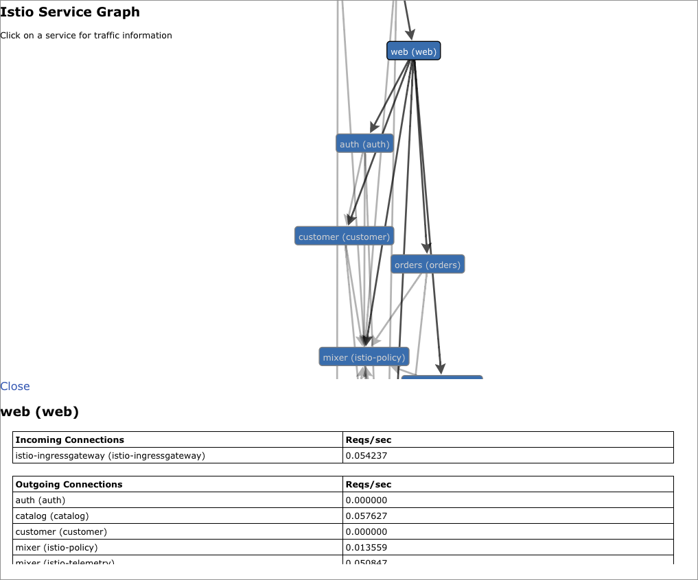

The above dashboard should give you a better idea of all of the incoming and outgoing connections for an invidual service, therefore, giving you a clearer picture of your entire stack networking-wise.

### Access Jaeger Tracing Dashboard
Using Grafana and Service Graph is useful to understand your application's architecture and overall networking usage and identify bottlenecks. However, you are out of luck when it comes to debugging the individual services' actual networking calls. Luckily, Jaeger can help you with that by providing useful tracing information for each networking call in your service mesh.

To access the Jaeger dashboard, you will need to run the following port-forwarding command:
```bash
kubectl -n istio-system port-forward $(kubectl -n istio-system get pod -l app=jaeger -o jsonpath='{.items[0].metadata.name}') 16686:16686 &;
```
Now, open a new browser tab and go to http://localhost:16686 to open Jaeger dashboard, as shown below:


The above page lets you enter some criteria to start searching for traces. Let's search for traces for the `web` service by selecting `web` in the `Service` drop-down menu, followed by clicking `Find Traces`. If any traces were found, you will see a view similar to the following:
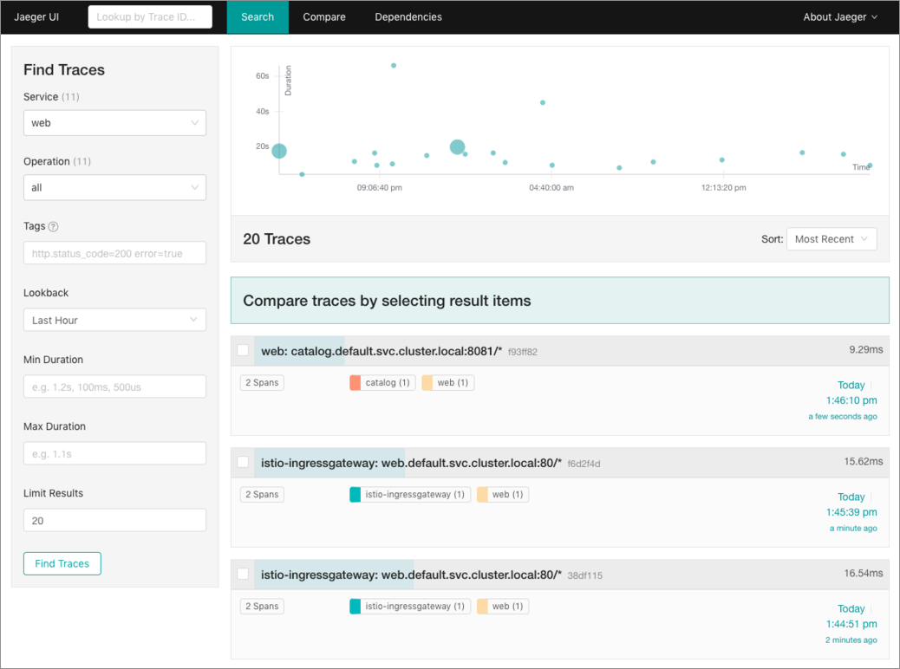

The view above shows you a list of matching traces along with a time graph that shows you trace duration over time. To view trace details, let's click on a trace that starts with `web: catalog.default.svc.cluster.local:8081/*`, which should reveal the following view:


In the view above you should be the number of spans. A span represents a logical unit of work in Jaeger that has an operation name, the start time of the operation, and the duration. Basically, a span is a networking step in the trace. From the above picture you see that there are 2 spans, the first is that of the request done by the `web` service to the `catalog` service. The second one is from the `catalog` service to the `elasticsearch` service.

If you click on any of the spans and expand both the `Tags` and `Process` fields, you will see useful networking information for that span, including things such as request url, HTTP method, HTTP status code, amongst other things that should help you debug your services.

### Access Kiali Dashboard
Using Grafana, Service Graph, and Jaeger tracing should give you more than enough information to learn your application's networking architecture, identify bottlenecks, and debug networking calls. This information alone is plenty to out carry day-to-day operations. However, there are instances when the tracing shows that a service is working as expected, but somehow, networking calls to other services still fail. Sometimes the issue comes from a bug in the individual service's Istio configuration, which you cannot access with the above mention dashboards.

Luckily, Kiali can help you with that. Kiali is an open source project that works with Istio to visualize the service mesh topology, including features like circuit breakers or request rates. Kiali even includes Jaeger Tracing out of the box.

To access the Kiali dashboard, you will need to run the following port-forwarding command:
```bash
kubectl -n istio-system port-forward $(kubectl -n istio-system get pod -l app=kiali -o jsonpath='{.items[0].metadata.name}') 20001:20001 &;
```

Now, open a new browser tab and go to http://localhost:20001/kiali to open Kiali dashboard, as shown below:


Login using `admin` and `secret` as the username and password, respectively, which come from the secret that you setup earlier when deploying Istio. If successful, you will be presented with the home page, which shows a graph of the services from all of the namespaces in your cluster.
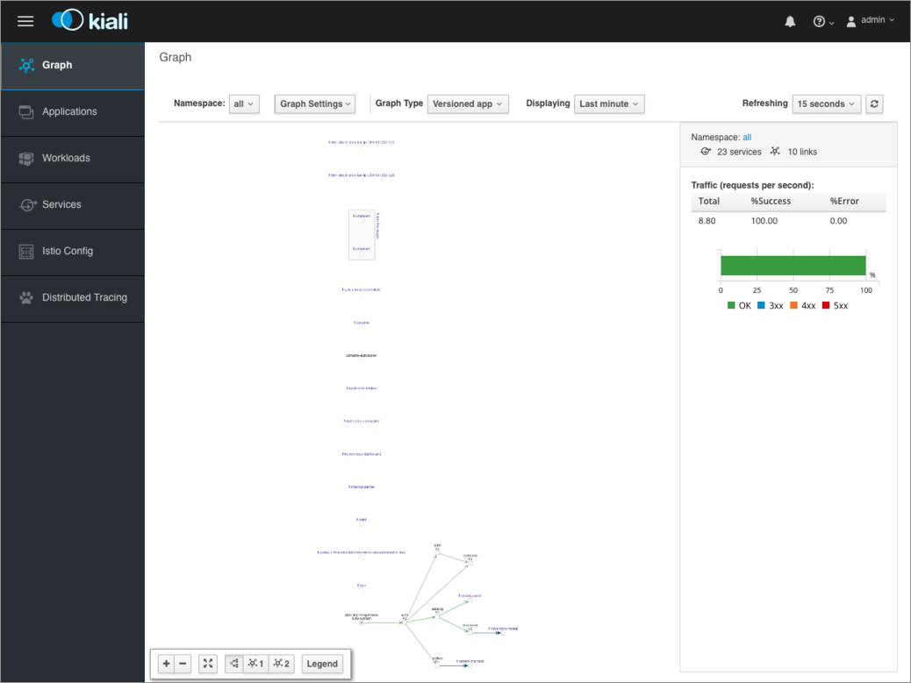

The above can be overwhelming to look at. Instead of looking at the entire cluster, let's just focus on the services in the `default` namespace, which is where `bluecompute-ce` is deployed. To view the services in the `default` namespace, click on the `Namespace` drop-down and select `default`, which should present you with the following view:


You should now see a much cleaner chart showing the services pertaining to `bluecompute-ce`. I personally like this graph better compared to `Service Graph`. From this graph you can click on the individual links between microservices and explore the request volume per second. Let's see what that looks like by clicking on the link between the `istio-ingressgateway` and `web` service, which should present you with the following view:


Notice above that you can see the requests per second and graphs for different status codes. Also notice in the `Source app` and `Destination app` that you can see namespace and version of the microservices in question. Feel free to explore the other application links.

If you click on the `Applications` menu on the left, followed by clicking on the `web` application, you will be able to see high level metrics for the application. Mostly the status of the health status of the deployment and the envoy side car and Inbound and Outboud metrics, as shown below:
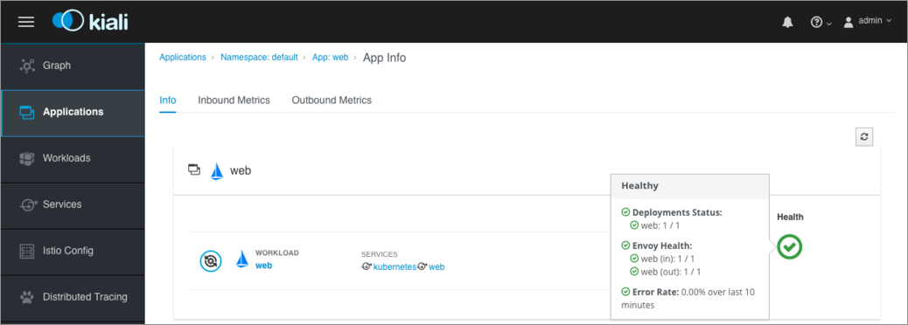

If you click on the `Workloads` menu on the left, followed by clicking on the `web` workload, you will be able to see pod specific information and metrics, including labels, container name and init container names, as shown below:
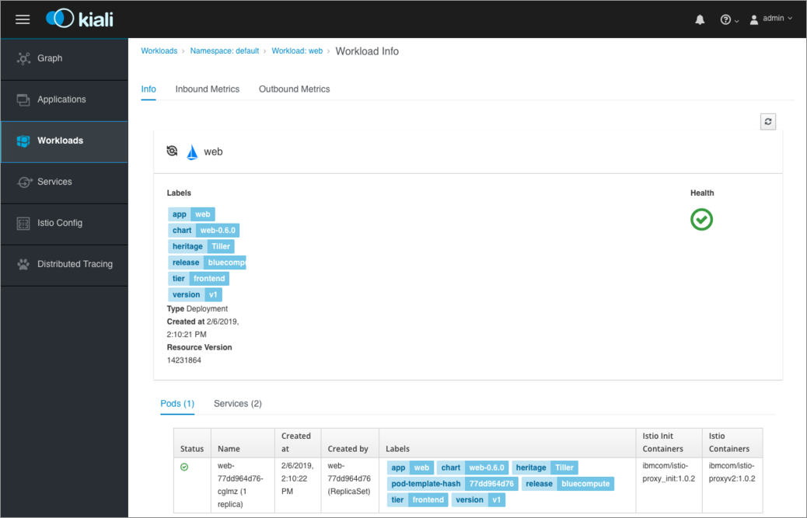

If you click on the `Services` menu on the left, followed by clicking on the `catalog` service, you will be able to see service specific information and metrics, but also workloads that the service is associated with and source workloads from which it gets networking calls, as shown below. More importantly, you can also see the `Virtual Services` and `Destination Rules` associated with the service and their configuration. You can even click on `View YAML` to explore the actual YAML file that was used to deploy the Istio resources, which is great for debugging Istio configuration.
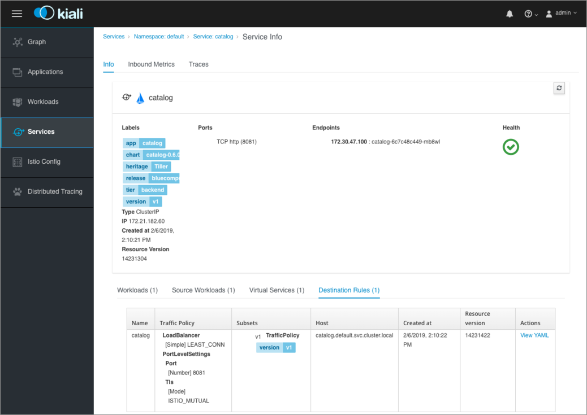

Lastly, if you want to only see a list of Istio resources, you can click on the `Istio Config` menu on the left. You will see things like `Virtual Services`, `Destination Rules`, and even `Gateways`.
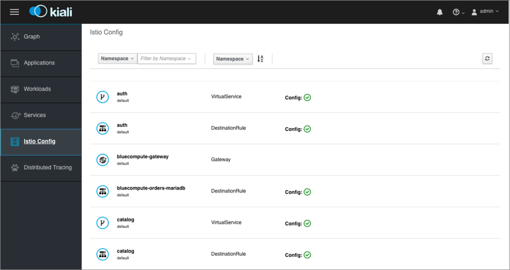

The above should have provided you a high level view of Kiali's features and visibility into the Istio Service Mesh. Combined with Jaeger Tracing and even Grafana dashboard, if enabled, you should be able to use Kiali as the main entrypoint for all things service mesh.

## Cleanup
To kill all port-forwarding connections, run the following command:
```bash
killall kubectl
```

To delete Kiali secret, run the following command:
```bash
kubectl delete secret kiali -n istio-system
```

To disable automatic sidecar injection, run the following command:
```bash
kubectl label namespace default istio-injection-
```

To uninstall `bluecompute-ce` chart, run the following command:
```bash
helm delete bluecompute --purge # --tls if using IBM Cloud Private
```

Lastly, to uninstall `istio` chart, run the following command:
```bash
helm delete istio --purge # --tls if using IBM Cloud Private
```

## Conclusion
Congratulations for finishing reading this document. That was a lot of information. Let's recap the stuff we learned today:
* Minimum requirements to allow pods to benefit from the service mesh features.
* How to properly create liveness and readiness probes that will work in a service mesh, even when Mutual TLS is enabled.
* Istio's current limitations with StatefulSet-based services and how to to get Deployment-based Istiofied services to communicate with StatefulSet services outside of the service mesh.
* How to create custom Istio YAML files for more granular control of Istio configuration for each microservice.
* Deployed Istio and enabled Grafana, Service Graph, Jaeger Tracing, and Kiali dashboards.
* Deployed the Bluecompute into Istio-enabled cluster and enabled Istio Gateway.
* Generated networking load against Istio Gateway to generate telemetry and tracing metrics for the web and catalog services.
* Used Grafana to visualize the networking request volume on both services.
* Used Service Graph to visualize Bluecompute's entire network architecture and view inbound and outbound request volume on each service.
* Used Jaeger to search and analyze network traces for calls between the web and catalog services.
* Used Kiali to do all the above plus exploring Istio configuration for each service.

By doing all the above, you now have the ability to modify existing services/applications to leverage most of the Istio service mesh features and debug running applications using Istio's telemetry and tracing information.