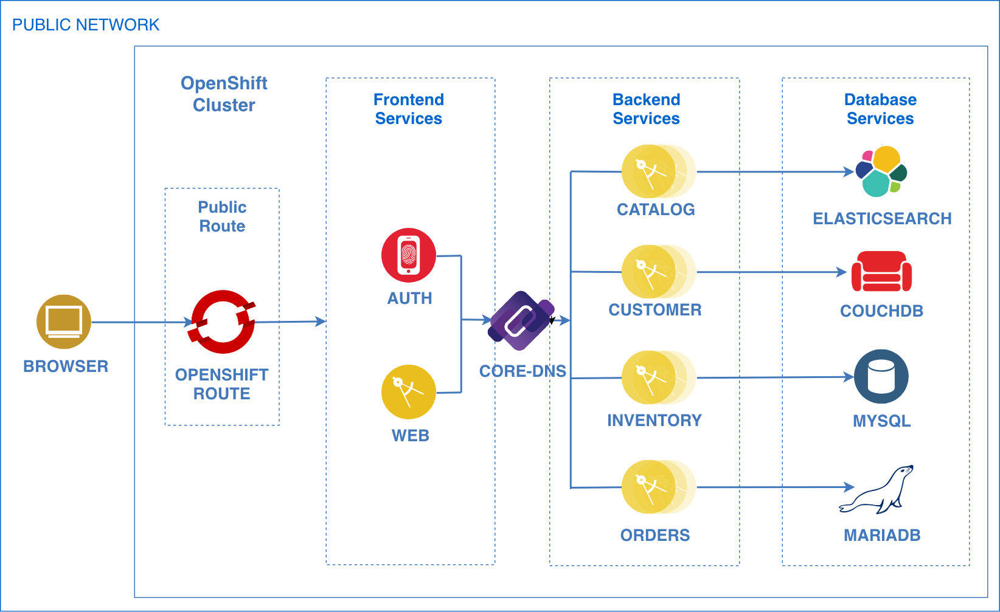

# Deploying the BlueCompute Microservices Reference Architecture to OpenShift

## Table of Contents
  * [Introduction](#introduction)
  * [Requirements](#requirements)
  * [Architecture](#architecture)
  * [Adopting OpenShift Container Best Practices](#adopting-openshift-container-best-practices)
    + [Creating Non-Root Docker Images](#creating-non-root-docker-images)
  * [Deploy BlueCompute to OpenShift](#deploy-bluecompute-to-openshift)
    + [1. Create `bluecompute` Project in OpenShift](#1-create-bluecompute-project-in-openshift)
    + [2. Generate YAML Files from Helm Charts](#2-generate-yaml-files-from-helm-charts)
    + [3. Remove Elasticsearch Privileged Containers](#3-remove-elasticsearch-privileged-containers)
    + [4. Deploy BlueCompute to OpenShift Project](#4-deploy-bluecompute-to-openshift-project)
    + [5. Expose the Web Application](#5-expose-the-web-application)
    + [6. Validate the Web Application](#6-validate-the-web-application)
  * [Cleanup](#cleanup)
  * [Conclusion](#conclusion)

## Introduction
[OpenShift](https://learn.openshift.com/) is a Kubernetes distribution from RedHat that is loaded with features that make developers' lives easier. Features such as strict security policies, routes, ImageStreams, integrated Jenkins, and many more features make OpenShift a well-rounded platform that's ready for production compared to vanilla Kubernetes, on which you would have to implement or put together all those features yourself.

However, there is one key feature that Kubernetes supports and OpenShift doesn't, at least officially, and that's the ability to deploy Helm charts. Helm is Kubernetes official package manager, which uses a sophisticated template engine and package versioning, is much more flexible than OpenShift templates. On top of that, the Helm community has contributed a great amount of Helm charts for common applications like Jenkins, Redis, and MySQL (among many others) that have been battle tested. These charts make vanilla Kubernetes much more appealing as it makes standing up an entire software stack much easier.

The problem with the community Helm Charts is that some of them deploy containers with privileged access, which is not supported by OpenShift by default. Also, Helm's current architecture (Tiller component installed as Pod with huge permissions) isn’t compatible with more strict security polices in OpenShift.

Not all is lost, however, as there are workarounds that we can use that won't compromise best practices or security. In this document you will learn how to deploy all of the IBM Microservices Reference Architecture services (known as [`bluecompute-ce`](https://github.com/ibm-cloud-architecture/refarch-cloudnative-kubernetes/tree/spring)) into an OpenShift cluster by generating YAML files from the Helm charts and making a few tweaks in them.

## Requirements
* OpenShift Cluster
	+ Deploy a local OpenShift cluster using [Minishift](https://docs.okd.io/latest/minishift/getting-started/index.html).
	+ The Minishift installation should also install the OpenShift CLI `oc`.
* [kubectl](https://kubernetes.io/docs/user-guide/kubectl-overview/) (Kubernetes CLI) - Follow the instructions [here](https://kubernetes.io/docs/tasks/tools/install-kubectl/) to install it on your platform.
* [helm](https://github.com/kubernetes/helm) (Kubernetes package manager) - Follow the instructions [here](https://github.com/kubernetes/helm/blob/master/docs/install.md) to install it on your platform.

## Architecture


As you can see, the application architecture hasn't changed much (check out original architecture [here](https://github.com/ibm-cloud-architecture/refarch-cloudnative-kubernetes/tree/spring#introduction)) other than using an `OpenShift Route` used to expose the web application outside the cluster instead of Kubernetes `Ingress` or `NodePort`. Also, instead of using `kube-dns` for service discovery, OpenShift uses `core-dns`.

Now that we understand the basic architecture, let's move on to learning how to deploy `bluecompute-ce` into OpenShift.

## Adopting OpenShift Container Best Practices
The great thing about OpenShift is that it enforces security best practices for containers out of the box, such as requiring Docker images to run as non-root and disallowing privileged containers, which can be harmful to the OpenShift cluster if not used properly.

After taking a look at what it would take for the `bluecompute-ce` services to adopt OpenShift best practices, here is an overview of what we encountered.

* Though the BlueCompute Docker images were built with official `openjdk` images, the images run as the `root` user.
	+ We needed to edit the Dockerfiles to run as non-root.
* Also, the community helm chart for `Elasticsearch` has 2 init containers that increase the virtual memory `max_map_count` and disable memory swapping before starting the `Elasticsearch` service.
	+ These operations require the init containers to be privileged, which is not allowed in OpenShift.
	+ Since this is a community chart, there is nothing we can do to edit the chart directly.
	+ Therefore, in a later section, we will explain how to get rid of these containers after generating YAML files out of the helm charts.
* The Docker Images for `mysql`, `couchdb`, and `mariadb` Helm Charts already run as non-root, so no changes are required for these.

Luckily, the changes to be made were quite simple. We just had to convert all the `bluecompute-ce` services's Docker images to run as non-root, which we will go over in the next section.

### Creating Non-Root Docker Images
As mentioned earlier, the official base `openjdk` Docker images that we used to build the BlueCompute microservices run as `root`. To overcome this, we created the `blue` user in the Dockerfiles and used it to run the application as non-root.

However, I realized that the application's `jar` file was running from the `/` folder, which is owned by the `root` user and cannot be owned by any other user. To overcome this we created the `/app` folder, put the jar file in there and changed the folder's permissions to be owned by the `blue` user and the `root` group. The `root` group, which does not have root privileges and is to not be confused by the `sudoers`, is necessary since OpenShift may launch the container with an arbitrary user id that belongs to the `root` group. If the app folder is also owned by the `root` group, then an arbitrary user (with non-root privileges) in the `root` group will be able to read and execute the files in that folder, which is what we want security-wise.

Here is the `inventory` Dockerfile, which shows the changes mentioned above:
```Dockerfile
# STAGE: Build
FROM gradle:4.9.0-jdk8-alpine as builder

# Create Working Directory
ENV BUILD_DIR=/home/gradle/app/
RUN mkdir $BUILD_DIR
WORKDIR $BUILD_DIR

# Download Dependencies
COPY build.gradle $BUILD_DIR
RUN gradle build -x :bootRepackage -x test --continue

# Copy Code Over and Build jar
COPY src src
RUN gradle build -x test

# STAGE: Deploy
FROM openjdk:8-jre-alpine

# Install Extra Packages
RUN apk --no-cache update \
 && apk add jq bash bc ca-certificates curl \
 && update-ca-certificates

# Create app directory
ENV APP_HOME=/app
RUN mkdir -p $APP_HOME/scripts
WORKDIR $APP_HOME

# Copy jar file over from builder stage
COPY --from=builder /home/gradle/app/build/libs/micro-inventory-0.0.1.jar $APP_HOME
RUN mv ./micro-inventory-0.0.1.jar app.jar

COPY startup.sh startup.sh
COPY scripts/max_heap.sh scripts/

# Create user, chown, and chmod
RUN adduser -u 2000 -G root -D blue \
	&& chown -R 2000:0 $APP_HOME \
	&& chmod -R u+x $APP_HOME/app.jar

USER 2000

EXPOSE 8080 8090
ENTRYPOINT ["./startup.sh"]
```

Notice the `# Create app directory` section where we define and create the `/app` folder. Also notice the `# Create user, chown, and chmod` section where we create the `blue` user (with numeric value `2000`) and assign it to the `root` group (again not to be confused with `sudoers`), and change the permissions of the `/app` folder to be owned by `blue` and the `root` group. Lastly, in the `USER 2000` line we specify that the image should run as the numeric user `2000`. OpenShift requires that a numeric user is used in the `USER` declaration instead of the user name. This allows OpenShift to validate the authority the image is attempting to run with and prevent running images that are trying to run as root (as mentioned in the [OpenShift-Specific Guidelines](https://docs.openshift.com/enterprise/3.0/creating_images/guidelines.html#openshift-specific-guidelines)).

The changes above were made to all the Dockerfiles in the `Spring Boot` services (`inventory`, `catalog`, `customer`, `orders`, and `auth`). The `web` service adopted the same concepts but tailored for `Node.JS`.

Now that we are aware of these changes, which have already been checked into each service's git repository, let's proceed with deploying all services to OpenShift.

## Deploy BlueCompute to OpenShift
Now that we are aware of all the changes that `bluecompute-ce` had to go through to adopt not just OpenShift but containers best practices, we can proceed with deploying `bluecompute-ce` into OpenShift.

**NOTE:** This section assumes that you have a working OpenShift cluster.

We are not going to deploy the Helm charts themselves into OpenShift. Though it is possible to deploy Helm charts into OpenShift, according to this [OpenShift Blog](https://blog.openshift.com/getting-started-helm-openshift/) it is not the official and supported way of deploying workloads into OpenShift.

There is also the option of converting the Helm Charts into [OpenShift Templates](https://docs.okd.io/latest/dev_guide/templates.html), but that would require a great amount of tedious work that's beyond the scope of this document.

The main goal is to get `bluecompute-ce` deployed into an OpenShift cluster as effortlessly and with as many best practices as possible. So, in this document we will be converting the `bluecompute-ce` Helm chart and all of its dependency charts into regular Kubernetes YAML files using the `helm template` function to and deploy them into the OpenShift cluster.

### 1. Create `bluecompute` Project in OpenShift
First thing we need to do is log into the OpenShift cluster:
```bash
oc login
```

Once that's done, then we must create a new project (OpenShift parlance for Kubernetes `namespace`) where we are going to deploy all of the `bluecompute-ce` YAML files:
```bash
oc new-project bluecompute
```

### 2. Generate YAML Files from Helm Charts
Now we are ready to generate the Kubernetes YAML files from the Helm Charts. To do so, runt he commands below:
```bash
# Make bluecompute-os directory where the YAML files will go
mkdir bluecompute-os

# Generate YAML
helm template docs/charts/bluecompute-ce/bluecompute-ce-0.0.9.tgz --namespace bluecompute --name bluecompute --set web.service.type=ClusterIP --output-dir bluecompute-os
```

Where:
* **--namespace** represents the Kubernetes namespace to be used to render the YAML files.
	+ This means that when deploying the generated YAML files, they will have the `bluecompute` OpenShift hardcoded.
* **web.service.type** was changed to `ClusterIP` as we will be using OpenShift `routes` to expose the web app in a later section.
* **name** is just the Helm release name, which is taken into account by Helm to name resources.
	+ In this case we are using `bluecompute`.

The above commands generated YAML files that can be deployed into OpenShift. However, there is still some work to be done, which will be covered in the next section.

### 3. Remove Elasticsearch Privileged Containers
The last thing we need to do before deploying the `bluecompute-ce` YAML files is remove the init containers from the `Elasticsearch` community helm chart. These containers are used to increase the virtual memory `max_map_count` and disable memory swapping before starting the `Elasticsearch` service, which require privileged access.

Since privileged containers are not allowed in OpenShift and performing those operations manually is beyond the scope of this document, we will remove the containers to allow the `Elasticsearch` containers to start. Depending on your environment, if Elasticsearch crashes or fails to start, you may be required to increase the virtual memory and disable swapping manually on each OpenShift node as explained by Elastic here:
* https://www.elastic.co/guide/en/elasticsearch/reference/current/vm-max-map-count.html and
* https://www.elastic.co/guide/en/elasticsearch/reference/current/setup-configuration-memory.html#mlockall

With that out of the way, let's go ahead and remove the privileged init containers from the `Elasticsearch` YAML files. To do so, assuming you exported the `bluecompute-ce` YAML files to the `bluecompute-os` folder, open the following 3 YAML files, delete the `initContainers` section, then save the files:
```bash
bluecompute-os/bluecompute-ce/charts/elasticsearch
└── templates
    ├── client-deployment.yaml
    ├── data-statefulset.yaml
    └── master-statefulset.yaml
```

Make sure to delete the entirety of the `initContainers` section, including both `sysctl` and `chown` containers and all their respective settings, if present.

Now you should be ready to deploy all of `bluecompute-ce` into the `bluecompute` OpenShift Project!

### 4. Deploy BlueCompute to OpenShift Project
To deploy the `bluecompute-ce` YAML files, use the command below:
```bash
oc apply --recursive --filename bluecompute-os
```

And just like that, you have deployed all of `bluecompute-ce` into an OpenShift cluster! To check on the status to see if they are up and running, run the following command:
```bash
oc get pods | grep -v test
```

You may need to run the above command multiple times to get an updated status for all pods. If you get an output similar to the following, then all the pods are up and running!

```bash
NAME                                               READY     STATUS      RESTARTS   AGE
auth-5dfdcb6f69-fqdct                              1/1       Running     0          3m
bluecompute-customer-create-user-jxkhp-csnqb       1/1       Running     0          2m
bluecompute-inventory-populate-mysql-rxkgz-gn4cm   0/1       Completed   0          2m
bluecompute-mariadb-0                              1/1       Running     0          2m
catalog-ccc5d84cc-2wswh                            1/1       Running     0          2m
catalog-elasticsearch-client-6d4ff69f66-dfhdt      1/1       Running     0          2m
catalog-elasticsearch-data-0                       1/1       Running     0          2m
catalog-elasticsearch-master-0                     1/1       Running     0          2m
catalog-elasticsearch-master-1                     1/1       Running     0          2m
customer-78466cf844-cj9t6                          1/1       Running     0          2m
customer-couchdb-couchdb-0                         2/2       Running     2          2m
inventory-b4d69bddc-sj6dw                          1/1       Running     0          2m
inventory-mysql-7d84694976-7msjt                   1/1       Running     0          2m
orders-847c77d5ff-zdk9s                            1/1       Running     0          2m
web-65d9fbc79-5lwdd                                1/1       Running     0          2m
```

Now that all of the pods are available, it's time to expose the web service outside the OpenShift cluster in order to access the web application through a web browser.

### 5. Expose the Web Application
OpenShift makes exposing the web service outside the cluster very easy by using the following command to create an OpenShift `route`, which is, if you will, OpenShift's version of Kubernetes `Ingress`:
```bash
oc expose svc web
```

Now that the service is exposed with a route, let's get the web route URL using the following command:
```bash
oc get route
```

If successful, you should see an output with the route URL similar to the following:
```bash
NAME      HOST/PORT                                    PATH      SERVICES   PORT      TERMINATION   WILDCARD
web       web-bluecompute.YOUR_CLUSTER_DOMAIN.com      web       http                 None
```

Where `YOUR_CLUSTER_DOMAIN.com` is the OpenShift Cluster's domain name and `web-bluecompute` is the CNAME created for the web route.

### 6. Validate the Web Application
To validate the application, open a browser window and enter the route URL from above and press enter. You should be able to see the web application's home page, as shown below.


You can reference [this link](https://github.com/ibm-cloud-architecture/refarch-cloudnative-bluecompute-web/tree/spring#validate-the-web-application) to validate the web application functionality. You should be able to see a catalog, be able to login, make orders, and see your orders listed in your profile (once you are logged in).

## Cleanup
To cleanup everything, run the following commands:
```bash
# Delete route
oc delete route web

# Delete all resources using YAML files
oc delete --recursive --filename bluecompute-os
```

## Conclusion
Congratulations, you were successfully able to deploy all `bluecompute-ce` microservices into an OpenShift cluster! Let's recap what we went over today:
* Learned about container best practices, such as running a container as non-root
* Created an OpenShift project to deploy `bluecompute-ce` into.
* Generated Kubernetes YAML files out of the `bluecompute-ce` Helm Charts.
* Deleted remaining privileged root containers from Elasticsearch YAML files.
* Deployed all of `bluecompute-ce` service into OpenShift project.
* Created an OpenShift route to expose the web application outside the cluster.

Unfortunately, Helm charts are not officially supported by OpenShift, therefore, the above approach is the closest you will get to deploying workloads that originated from Helm charts into OpenShift while leveraging OpenShift best practices.

If you still require the ability to run Helm Charts on OpenShift, such as those for IBM Middleware Helm Charts, I recommend you try out [IBM Cloud Private on OpenShift](https://www.ibm.com/support/knowledgecenter/en/SSBS6K_3.1.0/supported_environments/openshift/overview.html).

If you are set on the pure OpenShift path, I encourage you start converting the Kubernetes files we generated into [OpenShift Templates](https://docs.okd.io/latest/dev_guide/templates.html), which is the closest to a Helm Chart you will get in an OpenShift ecosystem.