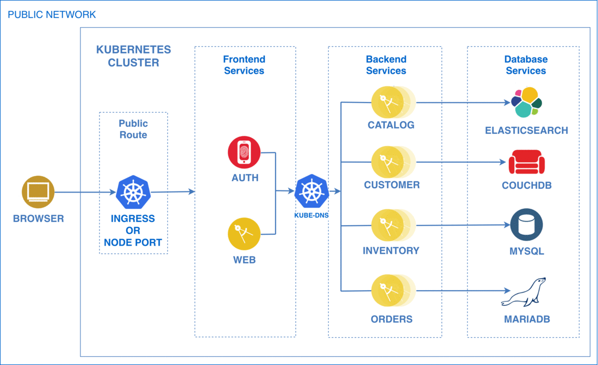

# Easy Way of Deploying Helm Charts on OpenShift
**Author:** Fabio Gomez (fabiogomez@us.ibm.com)

## Table of Contents
  * [Introduction](#introduction)
    + [Why doesn't OpenShift support community Helm Charts?](#why-doesnt-openshift-support-community-helm-charts)
  * [Steps for Deploying a Helm Chart into OpenShift](#steps-for-deploying-a-helm-chart-into-openshift)
    + [Requirements](#requirements)
  * [Adopting Container Best Practices](#adopting-container-best-practices)
    + [1. Creating Non-Root Docker Images](#1-creating-non-root-docker-images)
    + [2. Updating Helm Charts](#2-updating-helm-charts)
  * [Deploy Example Helm Charts on OpenShift](#deploy-example-helm-charts-on-openshift)
    + [Adopting Container Best Practices on BlueCompute](#adopting-container-best-practices-on-bluecompute)
    + [Deploy BlueCompute to OpenShift](#deploy-bluecompute-to-openshift)
      - [1. Create `bluecompute` Project in OpenShift](#1-create-bluecompute-project-in-openshift)
      - [2. Generate YAML Files from Helm Charts](#2-generate-yaml-files-from-helm-charts)
      - [3. Remove Elasticsearch Privileged Containers](#3-remove-elasticsearch-privileged-containers)
      - [4. Deploy BlueCompute to OpenShift Project](#4-deploy-bluecompute-to-openshift-project)
      - [5. Expose the Web Application](#5-expose-the-web-application)
      - [6. Validate the Web Application](#6-validate-the-web-application)
    + [Cleanup](#cleanup)
  * [Conclusion](#conclusion)

## Introduction
[OpenShift](https://learn.openshift.com/) is a Kubernetes distribution from Red Hat, similar to [IBM Cloud Private](https://www.ibm.com/cloud/private), that is loaded with features to make developers' lives easier. Features such as strict security policies, logging and monitoring, and many more make OpenShift a well-rounded platform that's ready for production, saving you the trouble of cobbling them together yourself from vanilla Kubernetes.

However, there is one key feature that Kubernetes supports and OpenShift doesn't, at least officially--the ability to deploy Helm charts.

Helm is the official package manager for Kubernetes. It uses a sophisticated template engine and package versioning that is much more flexible than OpenShift templates. In addition, the Helm community has contributed numerous Helm charts for common applications like Jenkins, Redis, and MySQL that have been production-tested. [IBM Cloud Private](https://www.ibm.com/cloud/private), a Kubernetes-based enterprise platform for containers, has full support for Helm and its community charts. It leverages Helm to create a UI-based catalog system that makes it easier to reuse the community charts. The catalog also lets you install/uninstall Helm charts with just a couple clicks, making it much easier to install an entire software stack.

### Why doesn't OpenShift support community Helm Charts?

Some community Helm Charts deploy containers with privileged access, which is not supported by OpenShift. IBM Cloud Private's flexible [Pod Security Policies](https://www.ibm.com/support/knowledgecenter/en/SSBS6K_3.1.2/manage_cluster/security.html), on the other hand, lets you choose the level of privilege you allow your containers to have based on your requirements.

Not all is lost for OpenShift fans, as there are workarounds that we can use that won't compromise best practices or security. That said, if you want the ability to run Helm Charts like those for IBM Middleware on OpenShift without workarounds, I recommend you try out [IBM Cloud Private on OpenShift](https://www.ibm.com/support/knowledgecenter/en/SSBS6K_3.1.2/supported_environments/openshift/overview.html), as it leverages the best of both IBM Cloud Private and OpenShift.

That option aside, if you are going the pure OpenShift route, this guide will walk you through converting existing Helm Charts into OpenShift compatible YAML files. If you're an operations engineer or developer familiar with Kubernetes, Helm, and OpenShift and you are interested in deploying the contents of existing Helm Charts on OpenShift, this recipe will save you time.
You will be able to leverage the hard work of the Helm community while maintaining container best practices--versus creating the equivalent OpenShift templates on your own.

## Steps for Deploying a Helm Chart into OpenShift
Below are the steps to deploy the contents of an existing Helm chart into an OpenShift cluster:
* Converting existing Docker images to run as non-root.
* Generating OpenShift-compatible YAML resource files from existing Helm Charts.
* Deploying the resource files into an OpenShift project.
* Exposing the services using OpenShift Routes.

The first half of this guide explains the steps for applying container best practices to a `Dockerfile` so it will work on OpenShift. The second half applies the guidelines of the first half to a specific example, the **IBM Microservices Reference Architecture** Helm Charts (known as [`bluecompute-ce`](https://github.com/ibm-cloud-architecture/refarch-cloudnative-kubernetes/tree/spring)), converting its existing Helm Charts to OpenShift-compatible YAML files.

**NOTE:** Assuming you have gone through all the Requirements in the following section, you should allow 30-45 minutes to complete this how-to.

### Requirements
* Basic knowledge of [Docker containers](https://docs.docker.com/), [Kubernetes](https://www.katacoda.com/courses/kubernetes), [Helm](https://www.katacoda.com/courses/kubernetes/helm-package-manager) and [OpenShift](https://learn.openshift.com/).
* OpenShift Cluster
  + Deploy a local OpenShift cluster using [Minishift](https://docs.okd.io/latest/minishift/getting-started/index.html).
  + The Minishift installation should also install the OpenShift CLI `oc`.
* [kubectl](https://kubernetes.io/docs/user-guide/kubectl-overview/) (Kubernetes CLI)
  + Follow the instructions [here](https://kubernetes.io/docs/tasks/tools/install-kubectl/) to install it on your platform.
* [helm](https://github.com/kubernetes/helm) (Kubernetes package manager)
  + Follow the instructions [here](https://github.com/kubernetes/helm/blob/master/docs/install.md) to install it on your platform.

## Adopting Container Best Practices
The following sections explain how to modify your `Dockerfile` and Helm Charts to run as non-root user, which is a container best practice recommended on Kubernetes-based platforms like OpenShift and IBM Cloud Private.

### 1. Creating Non-Root Docker Images
OpenShift enforces security best practices for containers out of the box, such as requiring Docker images to run as non-root and disallowing privileged containers, which can be harmful to the OpenShift cluster if they are compromised. In this section explains how to make a Spring Boot-based `Dockerfile` run as non-root.

Let's look at the `Dockerfile` for `bluecompute-ce's` inventory service for reference. You don't need to worry about what the service does, as we are only concerned with how the `Dockerfile` packages the code, followed by how to make it run as non-root.

**NOTE:** To learn more about `Dockerfile` options and their syntax, check out the [official documentation](https://docs.docker.com/engine/reference/builder/).

```Dockerfile
# STAGE: Build
FROM gradle:4.9.0-jdk8-alpine as builder

# Create Working Directory
ENV BUILD_DIR=/home/gradle/app/
RUN mkdir $BUILD_DIR
WORKDIR $BUILD_DIR

# Download Dependencies
COPY build.gradle $BUILD_DIR
RUN gradle build -x :bootRepackage -x test --continue

# Copy Code Over and Build jar
COPY src src
RUN gradle build -x test

# STAGE: Deploy
FROM openjdk:8-jre-alpine

# Install Extra Packages
RUN apk --no-cache update \
 && apk add jq bash bc ca-certificates curl \
 && update-ca-certificates

# Create app directory
ENV APP_HOME=/app
RUN mkdir -p $APP_HOME/scripts
WORKDIR $APP_HOME

# Copy jar file over from builder stage
COPY --from=builder /home/gradle/app/build/libs/micro-inventory-0.0.1.jar $APP_HOME
RUN mv ./micro-inventory-0.0.1.jar app.jar

COPY startup.sh startup.sh
COPY scripts/max_heap.sh scripts/

EXPOSE 8080 8090
ENTRYPOINT ["./startup.sh"]
```

Notice this is a two-stage [Multi-Stage Dockerfile](https://docs.docker.com/develop/develop-images/multistage-build/) based on the two `FROM` instructions in line 2 and 18. In the first stage (lines 1-15), we are using the official `gradle:4.9.0-jdk8-alpine` Docker image to download Gradle dependencies, build and test the application's code to generate a `jar` file. In the second stage (lines 17-38), we are using the official `openjdk:8-jre-alpine` Docker image to copy over the generated `jar` file from the previous stage, copy over the Docker entry-point script from source, and also expose the application ports.

**NOTE:** The main benefit of using the multi-stage approach is a Docker image with smaller layers. To learn more about the benefits of a multi-stage `Dockerfile`, read the [official documentation](https://docs.docker.com/develop/develop-images/multistage-build/).

The above `Dockerfile` is fairly standard for Spring Boot services and it is what we used for all the services in our Microservices Reference Architecture application. The only thing that remains to make the `Dockerfile` compatible with OpenShift security policies (and follow container best practices in general) is to create a non-root user to run the application process, which the base `openjdk` Docker image doesn't do by default. To do so, we have to add the following lines before the `EXPOSE` instruction:

```Dockerfile
# Create user, chown, and chmod
RUN adduser -u 2000 -G root -D blue \
  && chown -R 2000:0 $APP_HOME \
  && chmod -R u+x $APP_HOME/app.jar

USER 2000
```

Here is a quick breakdown of the commands above:
* The `adduser -u 2000 -G root -D blue` command creates the `blue` user with a user id of `2000` and adds it to the `root` group (not to be confused with `sudoers`).
  + OpenShift requires that a numeric user is used in the `USER` declaration instead of the user name. This allows OpenShift to validate the authority the image is attempting to run with and prevent running images that are trying to run as root (as mentioned in the [OpenShift-Specific Guidelines](https://docs.openshift.com/enterprise/3.0/creating_images/guidelines.html#openshift-specific-guidelines)).
* The `chown -R 2000:0 $APP_HOME` command changes the ownership of the `APP_HOME` folder to user `2000` (created above) and the `0` group (which is the `root` group).
  + This line will allow an arbitrary numeric user, assigned by OpenShift when launching the container, to start the application process.
* The `chmod -R u+x $APP_HOME/app.jar` command assigns execution permissions for application jar file to the user, which can be an arbitrary numeric user in the `root` group.

Fortunately, that's all the required changes to get this Docker image to run on OpenShift. Finally, here is a snippet of the complete `Dockerfile`:

```Dockerfile
# STAGE: Build
FROM gradle:4.9.0-jdk8-alpine as builder

# Create Working Directory
ENV BUILD_DIR=/home/gradle/app/
RUN mkdir $BUILD_DIR
WORKDIR $BUILD_DIR

# Download Dependencies
COPY build.gradle $BUILD_DIR
RUN gradle build -x :bootRepackage -x test --continue

# Copy Code Over and Build jar
COPY src src
RUN gradle build -x test

# STAGE: Deploy
FROM openjdk:8-jre-alpine

# Install Extra Packages
RUN apk --no-cache update \
 && apk add jq bash bc ca-certificates curl \
 && update-ca-certificates

# Create app directory
ENV APP_HOME=/app
RUN mkdir -p $APP_HOME/scripts
WORKDIR $APP_HOME

# Copy jar file over from builder stage
COPY --from=builder /home/gradle/app/build/libs/micro-inventory-0.0.1.jar $APP_HOME
RUN mv ./micro-inventory-0.0.1.jar app.jar

COPY startup.sh startup.sh
COPY scripts/max_heap.sh scripts/

# Create user, chown, and chmod
RUN adduser -u 2000 -G root -D blue \
  && chown -R 2000:0 $APP_HOME \
  && chmod -R u+x $APP_HOME/app.jar

USER 2000

EXPOSE 8080 8090
ENTRYPOINT ["./startup.sh"]
```

Now that the `Dockerfile` no longer requires root privileges, all that remains is to build the Docker image and push it to a Docker registry, such as [IBM Cloud Container Registry](https://www.ibm.com/cloud/container-registry) or Docker Hub. Do this with the following commands:

```bash
# CD to Dockerfile location
cd /path/to/dockerfile/folder

# Build Docker Image
docker build -t ${REGISTRY_LOCATION}/bluecompute-inventory:openshift .

# Push image to Docker Registry
docker push ${REGISTRY_LOCATION}/bluecompute-inventory:openshift
```

Where `${REGISTRY_LOCATION}` is the location of your Docker Registry and `openshift` is the new tag value for the image.

### 2. Updating Helm Charts
Before generating YAML from the Helm Charts, we have to update the Helm Charts with the newly-built Docker image. Simply edit the `values.yaml` file in the Chart and change the image's `tag` value to that of the new Docker image. For example, here is an excerpt of the `values.yaml` file for `bluecompute-ce`'s `inventory` Helm Chart:

```yaml
replicaCount: 1

image:
  repository: ibmcase/bluecompute-inventory
  tag: 0.6.0
  pullPolicy: Always
```

The `image.repository` field represents the Docker image location for this chart (Docker Hub in this case) and the `image.tag` field represents the Docker image's tag. To update the tag value to `openshift`, just replace the `0.6.0` value in `image.tag` with `openshift`, which will result in the following YAML:

```yaml
replicaCount: 1

image:
  repository: ibmcase/bluecompute-inventory
  tag: openshift
  pullPolicy: Always
```

Generally speaking, this is all you need to update a Helm Chart with an OpenShift compatible non-root Docker image. Most community Helm Charts don't have complicated configurations that require root privileges. But for those that do, they usually come in the form of one-off init containers that perform some administrative tasks on the container hosts. Usually, the workaround for those is to remove those containers from the charts themselves and perform those actions on the host yourself before deploying the charts. However, as with anything in software engineering, the changes you will have to make will depend on the chart and the workload itself and must be addressed individually.

With that knowledge in mind, let's move on to going over how we adapted the `bluecompute-ce` application to run its processes as non-root in order to work on OpenShift.

## Deploy Example Helm Charts on OpenShift
BlueCompute (known as `bluecompute-ce`) is IBM's Cloud-native Microservices Reference Architecture, which is used to demonstrate how clients can easily deploy and run a complex microservices application on Kubernetes based platforms such as [IBM Cloud Kubernetes Service](https://www.ibm.com/cloud/container-service) and [IBM Cloud Private](https://www.ibm.com/cloud/private), which are public and private cloud based, respectively.



The application itself is an [Angular JS 2](https://angular.io/) web front-end that communicates with multiple [Java Spring Boot](https://spring.io/projects/spring-boot) microservices. Each of those backend microservices communicates with its own datastore, which, in typical microservices fashion, can be whatever the developers choose to be the best tool for the job. In `bluecompute-ce`'s case, the datastores are Elasticsearch, CouchDB, MySQL, and MariaDB.

Each microservice has its own Git repository, which contains not only the application source, but also its respective `Dockerfile` and Helm chart. All of the datastore Helm charts were taken from the community [Helm Chart catalog](https://github.com/helm/charts) to demonstrate that existing applications can leverage community-made Helm charts for datastores.

Lastly, to make deploying the entire application easier, we created the `bluecompute-ce` Helm chart that declares all the individual Helm charts (including the community ones) as dependencies. This lets us deploy all of them at once with a single command. Deploying the application this way takes us 2-5 minutes compared to the 30-45 minutes it used to take us before we adopted Kubernetes.

As you can see from the diagram animation above, the application architecture doesn't change much (check out original architecture [here](https://github.com/ibm-cloud-architecture/refarch-cloudnative-kubernetes/tree/spring#introduction)) when deploying it to OpenShift. The main change is using an `OpenShift Route` to expose the web application outside the cluster instead of Kubernetes `Ingress` or `NodePort`. Also, instead of using `kube-dns` for service discovery, OpenShift uses `core-dns`, which we are not concerned with as developers.

Now that we understand the basic architecture, let's cover the steps to deploy `bluecompute-ce` into OpenShift, following the steps presented in the previous section.

### Adopting Container Best Practices on BlueCompute
As mentioned before, OpenShift enforces security best practices for containers out of the box, such as requiring Docker images to run as non-root and disallowing privileged containers, which can be harmful to the OpenShift cluster if they are compromised.

We looked at what it would take for the `bluecompute-ce` services to adopt container best practices; below is a summary of our findings:

* Although the BlueCompute Docker images were built with official `openjdk` images, the images run as the `root` user.
  + We needed to edit each `Dockerfile` to run as non-root, as explained in a previous section.
* Also, the community Helm chart for `Elasticsearch` has 2 init containers that increase the virtual memory `max_map_count` and disable memory swapping before starting the `Elasticsearch` service.
  + These operations require the init containers to be privileged, which is not allowed in OpenShift.
  + Since this is a community chart, there is nothing we can do to edit the chart directly.
  + Therefore, in a later section, we will explain how to eliminate the need for these containers after generating YAML files out of the Helm charts.
  + **NOTE:** The actual `elasticsearch` Docker image (not the init container one) runs as non-root, so no need to rebuild that one.
* The Docker Images for `mysql`, `couchdb`, and `mariadb` Helm charts already run as non-root, so no changes are required for these.

Luckily, the changes to be made were quite simple. We only had to convert all the `bluecompute-ce` services's Docker images to run as non-root as previously discussed. As an FYI, the changes were made to each `Dockerfile` in the `Spring Boot` services (`inventory`, `catalog`, `customer`, `orders`, and `auth`). The `web` service adopted the same concepts but tailored for Node.js.

With these changes checked into each service's Git repository, let's proceed with deploying all of the services to OpenShift.

### Deploy BlueCompute to OpenShift
Now that we covered the changes for `bluecompute-ce` to adopt not just OpenShift but containers best practices, it's time to deploy `bluecompute-ce` into OpenShift.

**NOTE:** This section assumes that you have a working OpenShift cluster.

We are not going to deploy the Helm charts themselves into OpenShift. Though it is possible to deploy Helm charts into OpenShift, according to the OpenShift blog [Getting started with Helm on OpenShift](https://blog.openshift.com/getting-started-helm-openshift/), it is not the official and supported way of deploying workloads into OpenShift.

There is also the option of converting the Helm charts into [OpenShift Templates](https://docs.okd.io/latest/dev_guide/templates.html), but that would require a lot of tedious work that's beyond the scope of this guide.

The main goal is to get `bluecompute-ce` deployed into an OpenShift cluster as effortlessly while following as many best practices as possible. So, in this guide we will be converting the `bluecompute-ce` Helm chart and all of its dependency charts into regular Kubernetes YAML files by using the `helm template` function to deploy them into the OpenShift cluster.

#### 1. Create `bluecompute` Project in OpenShift
First, log into the OpenShift cluster:

```bash
oc login
```

Next, create a new project (OpenShift parlance for Kubernetes `namespace`) to deploy the `bluecompute-ce` YAML files:

```bash
oc new-project bluecompute
```

#### 2. Generate YAML Files from Helm Charts
Now generate the Kubernetes YAML files from the Helm Charts. To do so, run the following commands:

```bash
# Make bluecompute-os directory where the YAML files will go
mkdir bluecompute-os

# Generate YAML
helm template docs/charts/bluecompute-ce/bluecompute-ce-0.0.9.tgz --namespace bluecompute --name bluecompute --set web.service.type=ClusterIP --output-dir bluecompute-os
```

Where:
* `--namespace` represents the Kubernetes namespace to be used to render the YAML files.
  + This means that when deploying the generated YAML files, they will have the `bluecompute` OpenShift hardcoded.
* `web.service.type` was changed to `ClusterIP` as we will be using OpenShift `routes` to expose the web app in a later section.
* `name` is just the Helm release name, which is taken into account by Helm to name resources.
  + In this case we are using `bluecompute`.

The above commands generated YAML files that can be deployed into OpenShift. However, there is still some work to be done. The next section explains the steps.

#### 3. Remove Elasticsearch Privileged Containers
Before deploying the `bluecompute-ce` YAML files, we must remove the init containers from the `Elasticsearch` community Helm chart. These containers are used to increase the virtual memory `max_map_count` and disable memory swapping before starting the `Elasticsearch` service, which require privileged access.

Since privileged containers are not allowed in OpenShift and performing those operations manually is beyond the scope of this guide, we will remove the containers to allow the `Elasticsearch` containers to start. Depending on your environment, if Elasticsearch crashes or fails to start, you may be required to increase the virtual memory and disable swapping manually on each OpenShift node as explained by Elastic in [Virtual Memory](https://www.elastic.co/guide/en/elasticsearch/reference/current/vm-max-map-count.html) and [Enable bootstrap.memory_lock](https://www.elastic.co/guide/en/elasticsearch/reference/current/setup-configuration-memory.html#mlockall).

With that out of the way, let's go ahead and remove the privileged init containers from the `Elasticsearch` YAML files. To do so, assuming you exported the `bluecompute-ce` YAML files to the `bluecompute-os` folder, open the following 3 YAML files, delete the `initContainers` section, then save the files:

```bash
bluecompute-os/bluecompute-ce/charts/elasticsearch
└── templates
    ├── client-deployment.yaml
    ├── data-statefulset.yaml
    └── master-statefulset.yaml
```

Make sure to delete the entirety of the `initContainers` section, including both `sysctl` and `chown` containers and all their respective settings, if present.

Now you should be ready to deploy all of `bluecompute-ce` into the `bluecompute` OpenShift Project!

#### 4. Deploy BlueCompute to OpenShift Project
To deploy the `bluecompute-ce` YAML files, use the command below:

```bash
oc apply --recursive --filename bluecompute-os
```

Voilà, you have deployed all of `bluecompute-ce` into an OpenShift cluster! To check on its status to confirm they are up and running, run the following command:

```bash
oc get pods | grep -v test
```

You may need to run the above command multiple times to get an updated status for all pods. Once you have an output similar to the following, then all the pods are up and running!

```bash
NAME                                               READY     STATUS      RESTARTS   AGE
auth-5dfdcb6f69-fqdct                              1/1       Running     0          3m
bluecompute-customer-create-user-jxkhp-csnqb       1/1       Running     0          2m
bluecompute-inventory-populate-mysql-rxkgz-gn4cm   0/1       Completed   0          2m
bluecompute-mariadb-0                              1/1       Running     0          2m
catalog-ccc5d84cc-2wswh                            1/1       Running     0          2m
catalog-elasticsearch-client-6d4ff69f66-dfhdt      1/1       Running     0          2m
catalog-elasticsearch-data-0                       1/1       Running     0          2m
catalog-elasticsearch-master-0                     1/1       Running     0          2m
catalog-elasticsearch-master-1                     1/1       Running     0          2m
customer-78466cf844-cj9t6                          1/1       Running     0          2m
customer-couchdb-couchdb-0                         2/2       Running     2          2m
inventory-b4d69bddc-sj6dw                          1/1       Running     0          2m
inventory-mysql-7d84694976-7msjt                   1/1       Running     0          2m
orders-847c77d5ff-zdk9s                            1/1       Running     0          2m
web-65d9fbc79-5lwdd                                1/1       Running     0          2m
```

Now that all of the pods are available, it's time to expose the web service outside the OpenShift cluster in order to access the web application through a web browser.

#### 5. Expose the Web Application
OpenShift makes exposing the web service outside the cluster very easy by using the following command to create an OpenShift `route`. It's essentially OpenShift's version of Kubernetes `Ingress`:

```bash
oc expose svc web
```

Now that the service is exposed with a route, retrieve the web route URL using the following command:

```bash
oc get route
```

You should see an output with the route URL similar to the following:

```bash
NAME      HOST/PORT                                    PATH      SERVICES   PORT      TERMINATION   WILDCARD
web       web-bluecompute.YOUR_CLUSTER_DOMAIN.com      web       http                 None
```

Where `YOUR_CLUSTER_DOMAIN.com` is the OpenShift Cluster's domain name and `web-bluecompute` is the CNAME created for the web route.

#### 6. Validate the Web Application
To validate the application, open a browser window and enter the route URL from above and press enter. You should be able to see the web application's home page, as shown below.


You can reference [this link](https://github.com/ibm-cloud-architecture/refarch-cloudnative-bluecompute-web/tree/spring#validate-the-web-application) to validate the web application functionality. You should be able to see a catalog, login, make orders, and see your orders listed in your profile (once you are logged in).

### Cleanup
To cleanup everything, run the following commands:

```bash
# Delete route
oc delete route web

# Delete all resources using YAML files
oc delete --recursive --filename bluecompute-os
```

## Conclusion
At the time of writing, Helm charts are not officially supported by OpenShift, therefore, the above approach is the closest you will get to deploying workloads that originated from Helm charts into OpenShift while leveraging container best practices.

If you still require the ability to run Helm Charts on OpenShift, such as those for IBM Middleware Helm Charts, I recommend you to try out [IBM Cloud Private on OpenShift](https://www.ibm.com/support/knowledgecenter/en/SSBS6K_3.1.2/supported_environments/openshift/overview.html).

If you already adopted IBM Cloud Private on OpenShift and/or are curious about managing Kubernetes workloads across a Hybrid Cloud architecture, check out [`IBM Multicloud Manager`](https://www.ibm.com/cloud/multicloud-manager). The tutorial [Manage an IBM Cloud Private on Red Hat OpenShift cluster by using Multicloud Manager](https://www.ibm.com/cloud/garage/tutorials/manage-icp-on-openshift-with-mcm) explains how.

If you are set on the pure OpenShift path, I encourage you start converting the Kubernetes files we generated into [OpenShift Templates](https://docs.okd.io/latest/dev_guide/templates.html), which is the closest to a Helm Chart you will get in an OpenShift ecosystem.