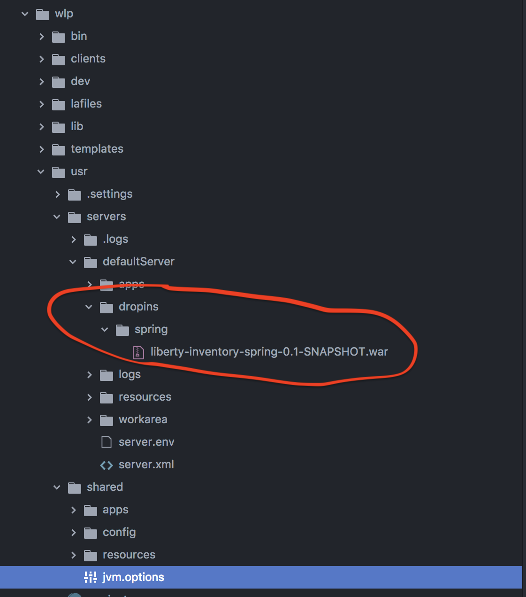
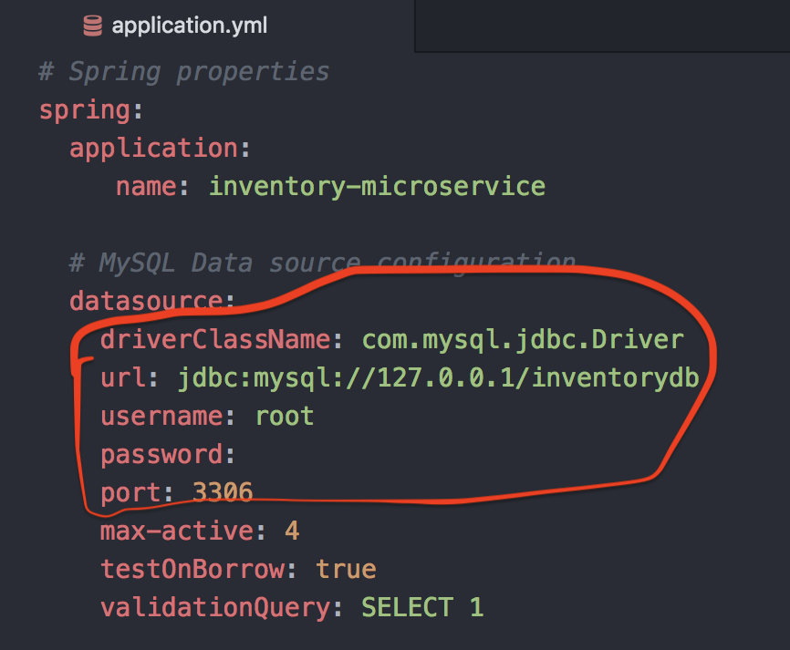
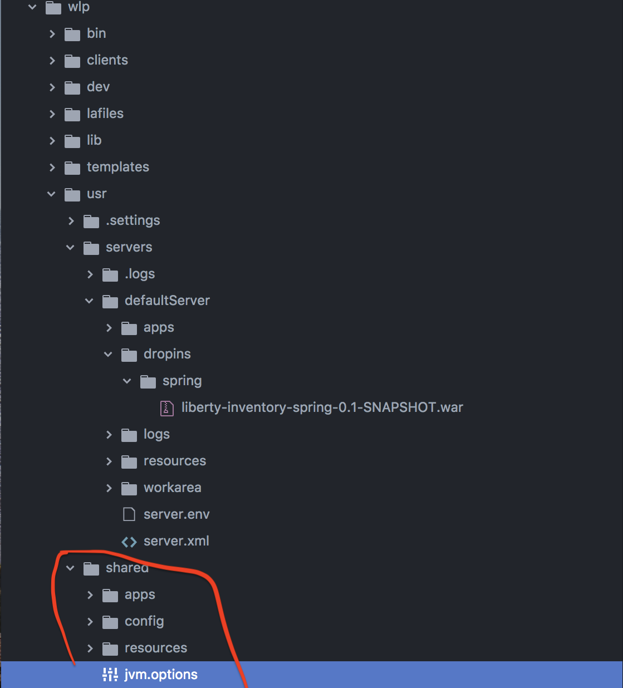
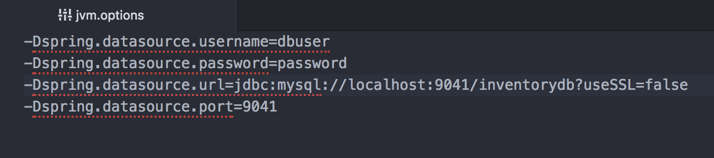

# Passing configuration at runtime to SprinBoot WAR running on WebSphere Liberty

### What do we need ?

The SpringBoot WAR file is deployed on WebSphere Liberty Profile. When it is deployed to the server, the application should be access to get the configuration values at run time. There is no access to the code and all we can access is the application `war` file. Also, the application is running on Liberty CLI and `./server run` should do everything.

### Our Approach

We are using [WebSphere Liberty WebProfile 8](https://developer.ibm.com/wasdev/downloads/download-latest-stable-websphere-liberty-runtime/) to run the demo application. For this usecase, we are using [Inventory service](https://github.com/ibm-cloud-architecture/refarch-cloudnative-micro-inventory/tree/spring) which is a part of our [BlueCompute](https://github.com/ibm-cloud-architecture/refarch-cloudnative-kubernetes) application.

Initially, we packaged the SpringBoot application as a `war` file. Let us now deploy this `war` file on WebSphere Liberty. You can do this by placing the file in `dropins` folder of the server. You can place it here `wlp > usr > servers > defaultServer > dropins > Spring > YourApplication.war`.

<p align="center">
    
</p>

Run `./server run` to start your application. When you do this, your application will pick up the configuration values from the below yaml which is a part of the application and this is packaged along with the application in the `war` file.

<p align="center">
    
</p>

If you want to pass the configuration values other than the ones specified in the above file, you need to override these values by passing them externally. You can do this by placing the values in `jvm.options`. You can create a file names `jvm.option` under the `shared` folder that comes with the server as below.

<p align="center">
    
</p>

Now populated the required values there as shown below. These are the same values which are existing in the previous `application.yaml` and we are now overriding them with the below values.

<p align="center">
    
</p>

Once we placed all the necessary values there, run the below command.
```
./server run
```

This time the server picks up the values from the `jvm.options` file which in turn overrides the values that comes as a part of the application.

If you are running on a Kube based environment, you can pass these `jvm.options` file in the config map something like below

```
apiVersion: v1
kind: ConfigMap
metadata:
 name: configmapxxx
data:
 jvm.options: |
   -Dspring.datasource.username=dbuser
   -Dspring.datasource.password=password
   -Dspring.datasource.url=jdbc://localhost:9041/inventorydb?useSSL=false
   -Dspring.datasource.port=9041
```
